# 矿区车载安全设备程序升级 App（PDS-APP）产品需求文档

| 项目 | 内容 |
|---|---|
| 文档版本 | v1.2 |
| 状态 | 草稿 / 待评审 |
| 作者 | Vic Guo |
| 日期 | 2026-09-30 |
| 目标平台 | Android（不上架应用市场，内部分发 APK） |
| App 界面语言 | 英文（English），见 6.7 |
| 配套文件 | `pds-app-prototype.html`（可点击原型，与本文档同目录）、`images/`（流程图与界面截图） |

## 修订记录

| 版本 | 日期 | 修订人 | 说明 |
|---|---|---|---|
| v1.0 | 2026-09-30 | Vic Guo | 初稿：一期完整需求 + 二期预留方案 |
| v1.1 | 2026-09-30 | Vic Guo | 新增 6.7 界面语言与国际化需求；原型与截图全部改为英文界面；补充 UI 术语对照表 |
| v1.2 | 2026-09-30 | Vic Guo | 纳入 PRD 评审意见（宋家强）与业务方问题：新增 6.8 设备身份识别、6.9 版本总览、二维码连接、日志分层与云端上传方案、中断后状态对账、Wi-Fi 抢断对策、一期轻量版本服务；第 10 章扩展为二期完整方案（功能、界面、接口、扩展预留）；附录 A 评审意见处理记录 |

---

## 1. 背景与问题

矿区每台车辆上安装了一台车载安全设备（碰撞预警等功能）。设备为 Linux 系统，自带 Wi-Fi 热点（覆盖约 10 m），支持 SSH 连接与控制。所有设备的 IP、SSH 端口、root 账号密码、Wi-Fi 密码完全一致，仅 Wi-Fi 名称（SSID）不同，用于区分车辆。

设备上运行一个业务程序，需要频繁进行版本升级。当前升级方式为：

1. 操作人员携带电脑到车旁，连接设备 Wi-Fi；
2. 通过 SSH 登录设备；
3. 停止当前运行程序；
4. 进入固定目录替换程序文件；
5. 重新启动程序，人工确认。

### 1.1 现状痛点

| 痛点 | 影响 |
|---|---|
| 操作人员需要掌握 SSH 命令 | 只有少数技术人员能执行，升级排期受限 |
| 步骤多、手工操作 | 容易漏步骤 / 输错命令，导致程序无法启动 |
| 必须携带电脑 | 矿区现场环境恶劣，携带电脑不便 |
| 无操作记录 | 无法追溯"哪台车升到了哪个版本、谁在什么时候升的、失败原因是什么" |

### 1.2 产品定位

一款面向矿区现场运维人员的 Android 工具类 App，用手机替代电脑，把"连 Wi-Fi → SSH → 停程序 → 替换文件 → 启程序 → 校验"整条链路封装为**一键升级**，并完整记录每台设备的升级日志。

---

## 2. 目标与范围

### 2.1 产品目标

| 编号 | 目标 | 衡量方式 |
|---|---|---|
| G1 | 非技术人员可独立完成升级 | 操作人员不需要输入任何命令；培训 10 分钟内上手 |
| G2 | 单台设备升级耗时可控 | 从连接 Wi-Fi 到提示成功 ≤ 3 分钟（100 MB 程序包，实际取决于 Wi-Fi 速率） |
| G3 | 升级过程可靠、可恢复 | 任一步失败可自动回滚到升级前状态，设备不会因升级失败而"变砖" |
| G4 | 升级过程可追溯 | 每台设备每次升级都有完整日志并可导出 |

### 2.2 分期范围

| 分期 | 范围 | 投入 |
|---|---|---|
| **一期（本 PRD 第 6 章）** | 设备扫描连接（含二维码连接）、设备身份识别（车号 / ID / SSID）、程序包准备（URL 下载 / 本地文件 / 版本清单）、版本总览（云端 / 手机 / 设备）、一键自动升级（含中断对账）、结果校验、分层日志记录与导出（可选 HTTP 上传）、设备参数配置 | 以 App 开发为主；后端仅需提供一个**静态版本清单 JSON + 程序包下载地址**（可放任意 HTTP 服务 / 对象存储，见 6.2.4），不改造 admin |
| **二期（本 PRD 第 10 章，完整方案，本期不开发）** | 对接 admin 后台：账号登录、版本库与灰度、日志离线同步与聚合、设备台账、设备维护工具箱（文件导入 / 导出、诊断命令）、App 自更新、设备身份编辑（待确认） | App + admin 后端 |

> 评审意见回应：一期确实需要"少量后端"才能实现"云上版本"展示与在线下载（评审意见 1）。方案取折中：一期只依赖一个静态 JSON 文件（无需开发接口），完全离线场景下该能力自动降级为手动 URL / 本地文件；admin 侧的正式接口放到二期。

### 2.3 一期非目标（明确不做）

- 不做 iOS 版本；
- 不上架应用市场，不做账号体系（二期与 admin 对接时补充）；
- 不做设备程序的编译 / 打包，App 只负责分发已经打好的程序包；
- 不做多台设备并行升级（Android 一次只能连接一个 Wi-Fi，一期为串行逐台升级）；
- 不做设备端 Agent 改造，一期完全基于设备现有的 SSH 能力。

---

## 3. 用户与使用场景

### 3.1 目标用户

| 角色 | 描述 | 诉求 |
|---|---|---|
| 现场运维员（主要用户） | 矿区现场人员，负责巡检、设备维护，不一定懂 Linux | 少操作、少思考、看得懂提示、出错知道怎么办 |
| 技术负责人 | 研发 / 实施工程师，负责发布程序版本、排查升级失败 | 能配置设备参数、能拿到详细日志定位问题 |

### 3.2 核心场景

**场景 A：单车升级**
运维员拿到新版本下载链接（或已把程序包拷到手机），走到车旁打开 App，扫描到该车 Wi-Fi 并连接，选择程序包，点击"开始升级"，等待提示成功。

**场景 B：停车场多车批量升级**
多台车停在一起，运维员依次切换连接不同车辆的 Wi-Fi，重复升级流程。程序包只需准备一次，App 记录每台车的结果，最后可以在日志页看到"本次共升级 N 台，成功 M 台"。

**场景 C：升级失败排查**
某台车升级失败，运维员在 App 内查看该次升级日志，把日志导出并通过微信 / 飞书发给技术负责人。技术负责人根据日志中的每一步命令输出定位问题。

**场景 D：无网络环境**
矿区没有移动网络。运维员在有网的地方（办公室）提前通过 URL 下载好程序包缓存在 App 内，到现场直接使用本地已下载的包。

---

## 4. 术语

| 术语 | 说明 |
|---|---|
| 设备 / 车载设备 | 安装在车上的 Linux 安全设备 |
| SSID | 设备发射的 Wi-Fi 名称，每台车唯一，作为设备标识 |
| 程序包 | 待部署到设备上的程序文件，可能是单文件或文件夹（打包为 zip） |
| 升级会话（Session） | 对一台设备执行一次完整升级的过程，拥有唯一 ID，对应一份日志 |
| 目标目录 | 设备上程序所在的固定目录 |
| 配置项 | 设备侧固定参数（IP、端口、账号、目录、启停命令等），在 App 设置页维护 |

---

## 5. 整体方案

### 5.1 系统架构（一期）

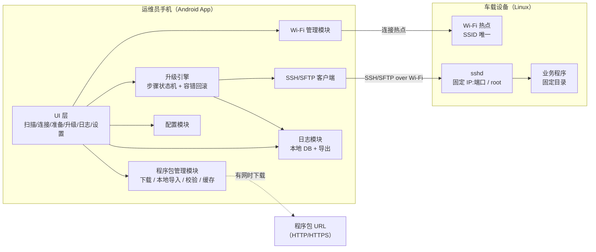
```mermaid
flowchart LR
    subgraph Phone["运维员手机（Android App）"]
        UI["UI 层<br/>扫描/连接/准备/升级/日志/设置"]
        WM["Wi-Fi 管理模块"]
        PM["程序包管理模块<br/>下载 / 本地导入 / 校验 / 缓存"]
        UE["升级引擎<br/>步骤状态机 + 容错回滚"]
        SSH["SSH/SFTP 客户端"]
        LOG["日志模块<br/>本地 DB + 导出"]
        CFG["配置模块"]
    end
    subgraph Vehicle["车载设备（Linux）"]
        AP["Wi-Fi 热点<br/>SSID 唯一"]
        SSHD["sshd<br/>固定 IP:端口 / root"]
        APP["业务程序<br/>固定目录"]
    end
    Remote["程序包 URL<br/>（HTTP/HTTPS）"]

    UI --> WM & PM & UE & LOG & CFG
    UE --> SSH
    UE --> LOG
    PM -. 有网时下载 .-> Remote
    WM -- 连接热点 --> AP
    SSH -- SSH/SFTP over Wi-Fi --> SSHD
    SSHD --> APP
```

### 5.2 一期 App 功能模块

| 模块 | 职责 |
|---|---|
| 设备扫描与连接 | 扫描附近 Wi-Fi，按 SSID 规则过滤出车辆设备，一键连接（密码默认填充），显示连接状态与信号强度，支持切换设备 |
| 程序包管理 | 支持 URL 下载与本地文件选择；统一为"程序包"对象；校验格式、大小、完整性；本地缓存与历史列表 |
| 升级引擎 | 按固定步骤序列对当前连接设备执行升级；每一步有超时、重试、失败分支；支持自动回滚 |
| 结果校验 | 读取设备上的程序版本与运行状态，与预期对比，给出明确的成功 / 失败提示 |
| 日志 | 记录每个升级会话的每一步：时间、命令、输出、耗时、结果；支持按设备 / 时间筛选；支持导出为文本 / zip 并通过系统分享 |
| 设置 | 维护设备配置项（IP、端口、账号密码、Wi-Fi 密码、SSID 前缀、目录、命令模板、超时）；配置可导入 / 导出 JSON，方便多台手机统一配置 |

### 5.3 端到端主流程

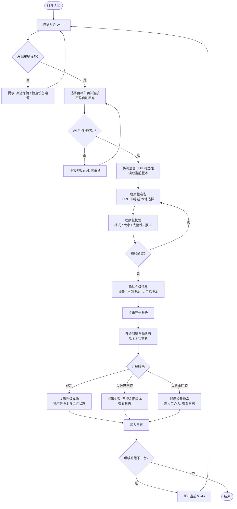
```mermaid
flowchart TD
    A([打开 App]) --> B[扫描附近 Wi-Fi]
    B --> C{发现车辆设备?}
    C -- 否 --> B1[提示: 靠近车辆 / 检查设备电源] --> B
    C -- 是 --> D[选择目标车辆并连接<br/>密码自动填充]
    D --> E{Wi-Fi 连接成功?}
    E -- 否 --> E1[提示失败原因, 可重试] --> D
    E -- 是 --> F[探测设备 SSH 可达性<br/>读取当前版本]
    F --> G[程序包准备<br/>URL 下载 或 本地选择]
    G --> H[程序包校验<br/>格式 / 大小 / 完整性 / 版本]
    H --> I{校验通过?}
    I -- 否 --> G
    I -- 是 --> J[确认升级信息<br/>设备 / 当前版本 → 目标版本]
    J --> K[点击开始升级]
    K --> L[升级引擎自动执行<br/>见 6.3 状态机]
    L --> M{升级结果}
    M -- 成功 --> N[提示升级成功<br/>显示新版本与运行状态]
    M -- 失败已回滚 --> O[提示失败, 已恢复旧版本<br/>查看日志]
    M -- 失败未回滚 --> P[提示设备异常<br/>需人工介入, 查看日志]
    N & O & P --> Q[写入日志]
    Q --> R{继续升级下一台?}
    R -- 是 --> S[断开当前 Wi-Fi] --> B
    R -- 否 --> T([结束])
```

---

## 6. 一期功能需求

### 6.1 设备扫描与连接

#### 6.1.1 功能描述

| 编号 | 需求 | 优先级 |
|---|---|---|
| F1-01 | App 启动进入"设备"页，自动触发一次 Wi-Fi 扫描，并提供手动"刷新"按钮 | P0 |
| F1-02 | 扫描结果按 SSID 规则过滤（配置项 `ssid_pattern`，如前缀 `PDS-`），仅展示车辆设备；提供"显示全部 Wi-Fi"开关用于调试 | P0 |
| F1-03 | 列表每项展示：SSID、**车号 / 设备 ID（来自本地设备簿，首次连接后缓存，见 6.8）**、信号强度（4 格图标 + dBm）、是否已连接、最近一次升级结果与版本（来自本地日志）。多台车混在一起时可凭车号而不是只凭 SSID 区分（评审意见 2） | P0 |
| F1-04 | 点击列表项 → 弹出连接确认（SSID、密码已默认填充可修改）→ 连接 | P0 |
| F1-05 | 连接过程中展示进度：正在连接 → 已连接 Wi-Fi → 正在探测设备（SSH 端口）→ 设备就绪（显示当前版本） | P0 |
| F1-06 | 已连接状态下，顶部常驻"当前设备卡片"：SSID、IP、当前程序版本、运行状态、断开按钮 | P0 |
| F1-07 | 切换设备：点击其他车辆时提示"将断开 XX 并连接 YY"，确认后自动断开再连接 | P0 |
| F1-08 | 升级进行中禁止切换 / 断开设备，需先取消升级 | P0 |
| F1-09 | 首次使用引导：申请定位权限 / 附近设备权限，并解释原因（Android 扫描 Wi-Fi 必须） | P0 |
| F1-10 | 手动输入 SSID 连接（应对隐藏 SSID 或扫描节流的兜底） | P1 |
| F1-11 | **扫码连接**：设备上粘贴二维码（内容含 SSID、Wi-Fi MAC/BSSID、可选车号与设备 ID，格式见下），App 扫码后直接连接，支持隐藏 SSID（评审意见 3）。二维码格式：`PDS:1;S:<ssid>;B:<bssid>;V:<vehicleNo>;I:<deviceId>;` | P1 |
| F1-12 | 列表支持按"未升级到当前程序包版本"筛选，批量升级时一眼看到还剩哪几台（评审意见 2） | P1 |
| F1-13 | **Wi-Fi 抢断防护**（评审意见"WIFI 抢断"）：① 使用 `WifiNetworkSpecifier` 绑定网络，系统不会因"无互联网"主动切走；② App 监听 `onLost`，一旦设备网络丢失立即提示并自动重连；③ 首次使用引导页与操作手册要求：在手机系统设置中把其他 Wi-Fi 设为"不自动连接"、关闭"自动切换到移动数据 / 智能 Wi-Fi 选择"等厂商功能；④ 设置页提供"检查 Wi-Fi 设置"入口，列出这些开关的位置 | P0 |

#### 6.1.2 Android 平台约束（研发注意）

| 约束 | 说明 | 方案 |
|---|---|---|
| Wi-Fi 扫描需要定位权限 | Android 9+ 扫描需 `ACCESS_FINE_LOCATION` 且定位开关打开；Android 13+ 可用 `NEARBY_WIFI_DEVICES` | 首次引导申请；定位未开启时给出跳转设置的提示 |
| 扫描节流 | Android 9+ 前台 App 每 2 分钟最多 4 次扫描 | 刷新按钮加倒计时防抖；缓存上次扫描结果并标注时间 |
| Android 10+ 不能直接代用户连 Wi-Fi | 需使用 `WifiNetworkSpecifier` + `ConnectivityManager.requestNetwork`，系统弹出确认框；该连接仅本 App 可用，不影响手机移动数据 | 一期采用此方案；SSH 连接必须通过返回的 `Network` 对象创建 socket（`network.socketFactory`），否则流量可能走移动网络 |
| 设备热点无互联网 | 系统可能判定"无网络"并自动切回其他 Wi-Fi | 使用 Specifier 方式绑定网络可避免；文档中提示用户"连接期间不要关闭 App" |
| 手机型号差异 | 部分国产 ROM 对 Specifier 支持有差异 | 一期指定 1–2 款测试机型作为验收基线；预留"手动去系统设置连接 Wi-Fi 后回 App"的兜底路径 |

#### 6.1.3 连接流程图

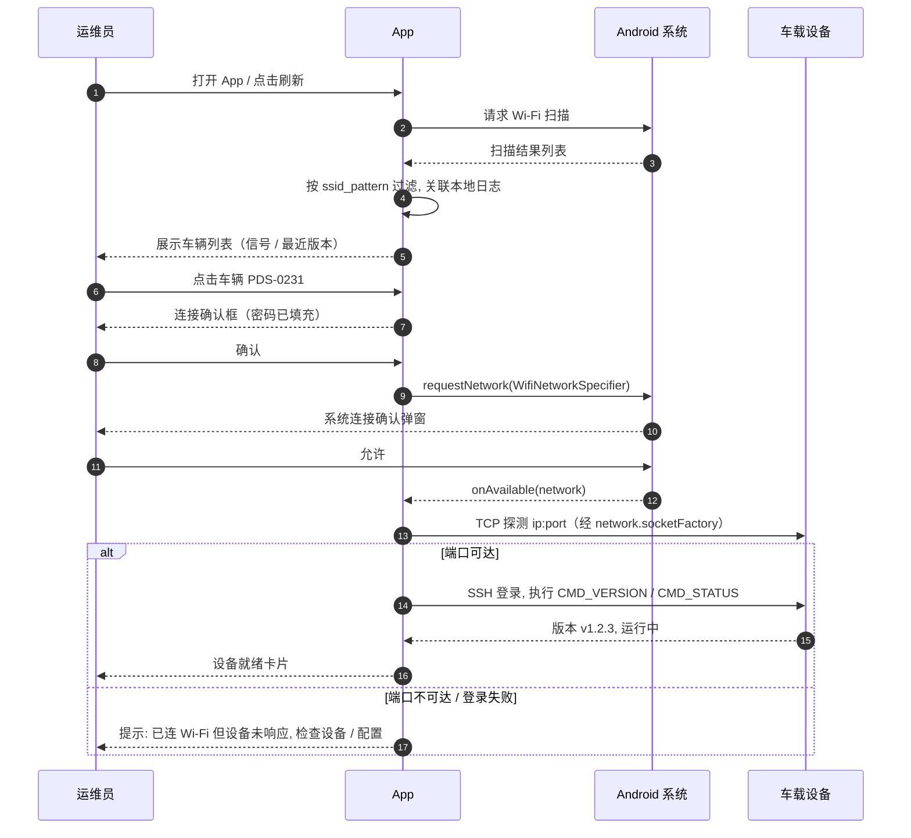
```mermaid
sequenceDiagram
    autonumber
    participant U as 运维员
    participant A as App
    participant OS as Android 系统
    participant D as 车载设备

    U->>A: 打开 App / 点击刷新
    A->>OS: 请求 Wi-Fi 扫描
    OS-->>A: 扫描结果列表
    A->>A: 按 ssid_pattern 过滤, 关联本地日志
    A-->>U: 展示车辆列表（信号 / 最近版本）
    U->>A: 点击车辆 PDS-0231
    A-->>U: 连接确认框（密码已填充）
    U->>A: 确认
    A->>OS: requestNetwork(WifiNetworkSpecifier)
    OS-->>U: 系统连接确认弹窗
    U->>OS: 允许
    OS-->>A: onAvailable(network)
    A->>D: TCP 探测 ip:port（经 network.socketFactory）
    alt 端口可达
        A->>D: SSH 登录, 执行 CMD_VERSION / CMD_STATUS
        D-->>A: 版本 v1.2.3, 运行中
        A-->>U: 设备就绪卡片
    else 端口不可达 / 登录失败
        A-->>U: 提示: 已连 Wi-Fi 但设备未响应, 检查设备 / 配置
    end
```

### 6.2 程序包准备

#### 6.2.1 程序包统一模型

为了同时支持"单文件"和"文件夹"两种形态并可闭环，App 内统一抽象为 `Package` 对象：

```
Package
├── id              本地唯一 ID
├── name            展示名（默认取文件名）
├── source          来源: URL / LOCAL /（二期）ADMIN
├── sourceRef       URL 地址 或 本地 URI
├── kind            SINGLE_FILE | ARCHIVE(zip)
├── localPath       App 私有目录中的缓存路径
├── size            字节数
├── sha256          整包 SHA-256
├── version         版本号（来自 manifest / 文件名 / 用户输入）
├── manifest        可选, 解析自 zip 内 manifest.json
├── status          DOWNLOADING | READY | INVALID
└── createdAt
```

**程序包格式规范（建议与研发 / 发版方约定）**

| 形态 | 规范 | App 处理方式 |
|---|---|---|
| 单文件 | 任意可执行文件 / 二进制，如 `pds_app_v1.3.0.bin` | 直接上传到目标目录，文件名由配置项 `target_file_name` 决定（或保持原名） |
| 文件夹 | 打包为 zip（`pds_app_v1.3.0.zip`），根目录建议包含 `manifest.json` | App 上传 zip 后在设备上 `unzip` 到临时目录再整体替换目标目录 |

`manifest.json`（可选，有则优先使用其中的信息）：

```json
{
  "name": "pds_app",
  "version": "1.3.0",
  "targetDir": "/opt/pds/app",
  "entry": "pds_app",
  "sha256": { "pds_app": "…", "config/default.yaml": "…" },
  "minAppVersion": "1.0.0",
  "preStop": null,
  "postStart": null,
  "notes": "修复碰撞预警误报"
}
```

无 manifest 时：版本号从文件名中按正则 `v?(\d+\.\d+\.\d+)` 提取，提取不到则要求用户手动填写；目标目录使用设置中的默认值。

#### 6.2.2 功能需求

| 编号 | 需求 | 优先级 |
|---|---|---|
| F2-01 | 进入"程序包"页可看到本地已缓存的程序包列表（名称、版本、大小、来源、时间、校验状态） | P0 |
| F2-02 | **URL 下载**：输入 / 粘贴 URL → 显示下载进度（速度、剩余）→ 完成后自动校验；支持暂停 / 取消 / 断点续传（HTTP Range） | P0 |
| F2-03 | **本地文件选择**：调用系统文件选择器（SAF）选择单文件或 zip；复制到 App 私有目录后校验 | P0 |
| F2-04 | **校验规则**：① 扩展名 / 魔数在允许列表（配置项 `allowed_extensions`）；② 大小在 `min_size`~`max_size` 范围；③ zip 可正常解压、无路径穿越；④ 若有 manifest 则校验 manifest 格式与内部 sha256；⑤ 若 URL 旁提供 `.sha256` 文件或用户粘贴了摘要则比对整包 sha256 | P0 |
| F2-05 | 校验失败明确提示原因（如"文件大小 3 KB，疑似下载了错误页面"），并将状态标为 INVALID | P0 |
| F2-06 | 选中一个 READY 状态的程序包作为"当前待升级包"，在设备页 / 升级页顶部显示 | P0 |
| F2-07 | 删除程序包、清理缓存；缓存总量上限（配置项，默认 2 GB） | P1 |
| F2-08 | 下载时若手机当前连接的是设备 Wi-Fi（无互联网），提示"当前网络无法访问互联网，请切换网络后下载"，并保留任务待网络恢复自动继续 | P1 |
| F2-09 | **版本清单（Cloud Versions）**：设置中配置 `version_manifest_url` 后，程序包页顶部显示"云端版本"区域：最新版本号、发布时间、说明、大小，以及历史版本列表；点击即可下载（内部走 F2-02 流程），无需手动粘贴 URL（评审意见 1）。清单格式见 6.2.4 | P0 |
| F2-10 | 有网时打开 App 自动刷新版本清单并缓存；无网时显示上次缓存及时间戳；未配置清单地址时该区域隐藏 | P0 |

#### 6.2.4 一期轻量版本服务（静态版本清单）

一期不要求 admin 开发接口，只需在任意可通过 HTTPS 访问的位置（对象存储、Nginx 静态目录、甚至 GitHub Release）放一个 `versions.json`，由发版人员手动维护；二期由 admin 版本库自动生成同一格式，App 无需改动。

```json
{
  "schema": 1,
  "updatedAt": "2026-09-30T09:00:00+08:00",
  "latest": "1.3.0",
  "packages": [
    {
      "version": "1.3.0",
      "name": "pds_app_v1.3.0.zip",
      "url": "https://release.example.com/pds/pds_app_v1.3.0.zip",
      "sha256": "3f9a…c21e",
      "size": 90596352,
      "releasedAt": "2026-09-29",
      "notes": "Fix false collision alerts",
      "minDeviceVersion": "1.1.0",
      "channel": "stable"
    },
    { "version": "1.2.3", "name": "pds_app_v1.2.3.bin", "url": "…", "sha256": "…", "size": 43201536, "releasedAt": "2026-09-10", "notes": "…", "channel": "stable" }
  ]
}
```

| 字段 | 说明 |
|---|---|
| `latest` | 当前推荐版本，用于版本总览中的"Cloud"列（见 6.9） |
| `packages[]` | 可下载的版本列表，按版本号倒序；App 用 `sha256` 做下载后校验 |
| `minDeviceVersion` | 可选，设备当前版本低于该值时提示"需先升级到中间版本" |
| `channel` | 可选，`stable` / `beta`，一期只展示 `stable`，二期用于灰度 |

App 侧对清单的处理：HTTPS GET，`ETag`/`If-None-Match` 缓存；解析失败或 `schema` 不匹配时提示"版本清单格式错误"，保留旧缓存。

#### 6.2.3 程序包状态流转

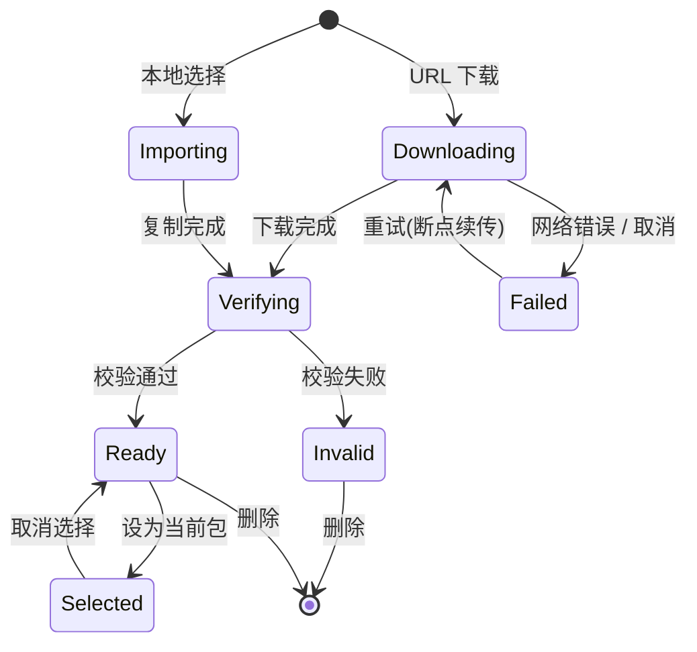
```mermaid
stateDiagram-v2
    [*] --> Downloading: URL 下载
    [*] --> Importing: 本地选择
    Downloading --> Verifying: 下载完成
    Downloading --> Failed: 网络错误 / 取消
    Failed --> Downloading: 重试(断点续传)
    Importing --> Verifying: 复制完成
    Verifying --> Ready: 校验通过
    Verifying --> Invalid: 校验失败
    Invalid --> [*]: 删除
    Ready --> Selected: 设为当前包
    Selected --> Ready: 取消选择
    Ready --> [*]: 删除
```

### 6.3 一键升级（核心）

#### 6.3.1 前置条件

- 已连接某台车辆 Wi-Fi 且设备探测成功（SSH 可登录）；
- 已选择一个 READY 状态的程序包；
- 手机电量 ≥ 20%（低于时警告但不阻止）。

升级确认页展示：设备车号 / ID / SSID、设备当前版本 → 目标版本、程序包名称与大小、预计耗时、目标目录；用户点击"开始升级"后进入自动流程，期间保持屏幕常亮，并以前台服务（Foreground Service）方式运行，防止 App 被系统回收。

**升级前版本比对（必做，评审意见 6）**：进入确认页时 App 已通过 S0/S1 读到设备当前版本，按下表给出提示：

| 情况 | 提示 | 默认动作 |
|---|---|---|
| 目标版本 > 当前版本 | 正常展示 `v1.2.3 → v1.3.0` | 允许升级 |
| 目标版本 == 当前版本 | "Device already runs v1.3.0. Reinstall anyway?" | 需勾选"强制重装"才能继续 |
| 目标版本 < 当前版本 | "Target v1.2.3 is older than the device's v1.3.0. Downgrade?" | 二次确认 |
| 云端 latest > 目标版本（已配置版本清单） | "A newer version v1.4.0 is available in Cloud Versions." | 提示但允许继续 |
| 当前版本 < `minDeviceVersion` | "Device must be upgraded to v1.1.0 first." | 阻止 |

#### 6.3.2 升级步骤序列

每一步定义：命令模板（占位符来自配置项）、超时、失败策略。**所有命令模板均为可配置项，拿到真实设备后再确定默认值。**

| 步骤 | 名称 | 动作（命令模板示例） | 超时 | 失败策略 |
|---|---|---|---|---|
| S0 | 建立连接 | TCP 连接 `{ip}:{port}` → SSH 密码登录 `{user}/{password}` | 10 s，重试 3 次 | 终止（未改动设备，可直接重试） |
| S1 | 环境预检 | `uname -a`；`df -Pk {target_dir}` 检查剩余空间 ≥ 程序包 × 2；`which unzip sha256sum`；`{cmd_version}` 读取当前版本；`{cmd_status}` 读取运行状态 | 15 s | 终止（空间不足 / 缺工具时明确提示） |
| S2 | 上传程序包 | SFTP 上传到 `{tmp_dir}/{session_id}/`；显示进度 | 按大小动态（≥ 60 s） | 重试 2 次；仍失败则清理临时目录后终止 |
| S3 | 校验上传 | `sha256sum {tmp_file}` 与本地对比；zip 则 `unzip -t` 测试 | 30 s | 回到 S2 重传 1 次，仍失败终止 |
| S4 | 停止程序 | `{cmd_stop}`（如 `systemctl stop pds` 或 `pkill -f pds_app`）；轮询 `{cmd_status}` 直到停止 | 20 s | 超时执行 `{cmd_force_stop}`（`pkill -9`）；仍未停止 → 终止并标记"需人工介入" |
| S5 | 备份旧版本 | `mkdir -p {backup_dir}/{ts} && cp -a {target_dir}/. {backup_dir}/{ts}/` | 30 s | 终止 → 执行 `{cmd_start}` 恢复运行（阶段 A 回滚） |
| S6 | 替换文件 | 单文件：`cp {tmp_file} {target_dir}/{target_file_name} && chmod +x`；zip：`unzip -o {tmp_file} -d {tmp_dir}/{session_id}/extract && rsync -a --delete {extract}/ {target_dir}/`（无 rsync 则 `rm -rf` + `cp -a`） | 60 s | 触发**回滚**（阶段 B） |
| S7 | 启动程序 | `{cmd_start}`；`sync` | 20 s | 触发回滚 |
| S8 | 结果校验 | 等待 `{verify_delay}`（默认 5 s）后执行 `{cmd_status}` 与 `{cmd_version}`；要求：进程运行中 且 版本号 == 目标版本；可选：连续 3 次间隔 3 s 检查进程仍存活（防止启动后崩溃） | 30 s | 触发回滚 |
| S9 | 清理 | 删除 `{tmp_dir}/{session_id}`；按 `backup_keep` 保留最近 N 份备份 | 15 s | 仅记录警告，不影响成功结论 |
| S10 | 断开 | 关闭 SSH；记录总耗时；写日志 | — | — |

**升级标记文件（用于中断后对账）**：S4 之前在设备上写入 `{tmp_dir}/{session_id}.state`（JSON：sessionId、targetVersion、packageSha256、当前步骤、时间戳），之后每步更新；S9 清理时删除。作用是当手机侧中断后重新连上设备时，App 能从设备上读出"上次升级到底进行到哪一步"，而不是只凭手机本地记录猜测（评审意见 5）。

**中断后状态对账（Reconcile）**：以下任一情况触发：升级中 Wi-Fi 丢失且 60 s 内重连成功；App 被杀 / 手机重启后再次连接同一设备；用户在"未完成会话"提示中点击"Check device"。对账逻辑：

| 设备上读到的情况 | 判定 | App 行为 |
|---|---|---|
| `{cmd_version}` == 目标版本 且 `{cmd_status}` 运行中 | 设备其实已升级成功 | 会话结果标为 **SUCCESS（Reconciled）**，补做 S9 清理，提示"Device was upgraded successfully before the connection dropped" |
| 版本 == 目标版本 但未运行 | 替换完成但启动失败 / 未启动 | 执行 S7→S8；失败则回滚 |
| 版本 == 旧版本 且运行中，无 state 文件或 state 步骤 ≤ S3 | 升级未开始改动设备 | 会话标为 INTERRUPTED，提示可直接重新开始 |
| 版本 == 旧版本 且运行中，state 显示已回滚 | 设备侧已自动回滚（若 `{cmd_start}` 由 watchdog 拉起）| 会话标为 FAILED_RECOVERED |
| 程序未运行、目标目录不完整 / 版本无法读取 | 设备处于半升级状态 | 提示用户选择"Resume（从 S6 重新替换）"或"Roll back"，默认推荐 Roll back |
| SSH 无法连接 | 无法对账 | 保持 INTERRUPTED，提示靠近设备重试 |

**回滚（Rollback）流程**：`{cmd_stop}` → `rm -rf {target_dir}/*` → `cp -a {backup_dir}/{ts}/. {target_dir}/` → `{cmd_start}` → `{cmd_status}` + `{cmd_version}` 校验为旧版本。回滚成功 → 结果"失败（已恢复旧版本）"；回滚失败 → 结果"失败（设备异常，需人工介入）"，并在日志中标红。

#### 6.3.3 升级状态机

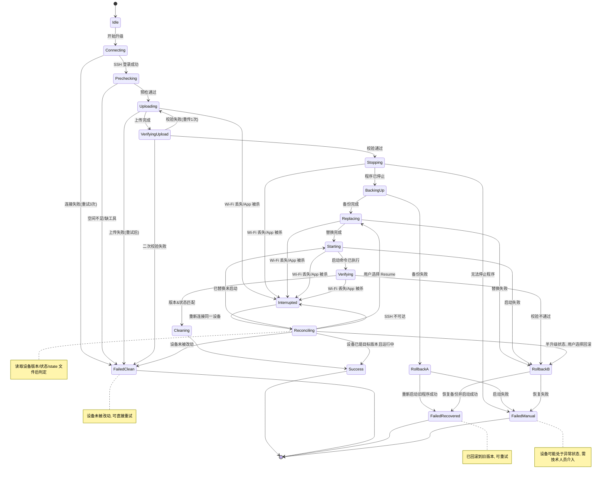
```mermaid
stateDiagram-v2
    [*] --> Idle
    Idle --> Connecting: 开始升级
    Connecting --> Prechecking: SSH 登录成功
    Connecting --> FailedClean: 连接失败(重试3次)
    Prechecking --> Uploading: 预检通过
    Prechecking --> FailedClean: 空间不足/缺工具
    Uploading --> VerifyingUpload: 上传完成
    Uploading --> FailedClean: 上传失败(重试后)
    VerifyingUpload --> Stopping: 校验通过
    VerifyingUpload --> Uploading: 校验失败(重传1次)
    VerifyingUpload --> FailedClean: 二次校验失败
    Stopping --> BackingUp: 程序已停止
    Stopping --> FailedManual: 无法停止程序
    BackingUp --> Replacing: 备份完成
    BackingUp --> RollbackA: 备份失败
    Replacing --> Starting: 替换完成
    Replacing --> RollbackB: 替换失败
    Starting --> Verifying: 启动命令已执行
    Starting --> RollbackB: 启动失败
    Verifying --> Cleaning: 版本&状态匹配
    Verifying --> RollbackB: 校验不通过
    Cleaning --> Success
    RollbackA --> FailedRecovered: 重新启动旧程序成功
    RollbackA --> FailedManual: 启动失败
    RollbackB --> FailedRecovered: 恢复备份并启动成功
    RollbackB --> FailedManual: 恢复失败
    Uploading --> Interrupted: Wi-Fi 丢失/App 被杀
    Stopping --> Interrupted: Wi-Fi 丢失/App 被杀
    Replacing --> Interrupted: Wi-Fi 丢失/App 被杀
    Starting --> Interrupted: Wi-Fi 丢失/App 被杀
    Verifying --> Interrupted: Wi-Fi 丢失/App 被杀
    Interrupted --> Reconciling: 重新连接同一设备
    Reconciling --> Success: 设备已是目标版本且运行中
    Reconciling --> Starting: 已替换未启动
    Reconciling --> Replacing: 用户选择 Resume
    Reconciling --> RollbackB: 半升级状态, 用户选择回滚
    Reconciling --> FailedClean: 设备未被改动
    Reconciling --> Interrupted: SSH 不可达
    Success --> [*]
    FailedClean --> [*]
    FailedRecovered --> [*]
    FailedManual --> [*]

    note right of Reconciling: 读取设备版本/状态/state 文件后判定
    note right of FailedClean: 设备未被改动, 可直接重试
    note right of FailedRecovered: 已回滚到旧版本, 可重试
    note right of FailedManual: 设备可能处于异常状态, 需技术人员介入
```

#### 6.3.4 升级过程 UI 需求

| 编号 | 需求 | 优先级 |
|---|---|---|
| F3-01 | 步骤列表（S0–S10）逐项展示状态：待执行 / 进行中（带耗时）/ 成功 / 失败 / 跳过；上传步骤显示进度条与速度 | P0 |
| F3-02 | 顶部总进度与预计剩余时间 | P1 |
| F3-03 | "取消"按钮：S0–S3 阶段可安全取消（清理临时文件）；S4 之后取消 = 触发回滚，需二次确认 | P0 |
| F3-04 | 升级中屏幕常亮、前台服务通知栏常驻；用户切到后台再回来状态保持 | P0 |
| F3-05 | 升级中检测到 Wi-Fi 断开：暂停并尝试自动重连（最多 60 s）；重连成功后先执行**状态对账**（6.3.2），再决定续传 / 继续 / 回滚 / 直接判成功；重连失败 → 标记 INTERRUPTED，指导用户重新连接后进入对账 | P0 |
| F3-09 | 对账页（Reconciling）：显示"Connection lost. Checking device state…"，读取完成后展示设备实际版本 / 状态与判定结论，按 6.3.2 表给出按钮（Done / Resume / Roll Back / Retry later） | P0 |
| F3-06 | 每一步的命令与设备输出可展开查看（技术人员用），默认折叠 | P1 |
| F3-07 | 结果页：成功（绿）/ 失败已恢复（橙）/ 失败需人工（红）三种；显示升级前后版本、总耗时、失败步骤与原因摘要；按钮："查看日志"、"重试"、"升级下一台" | P0 |
| F3-08 | 目标版本 == 当前版本时提示"设备已是该版本"，允许用户选择"强制重装" | P1 |

#### 6.3.5 异常场景与容错清单

| 编号 | 场景 | 检测方式 | 处理 | 用户提示 |
|---|---|---|---|---|
| E01 | 已连 Wi-Fi 但 SSH 端口不通 | S0 TCP 超时 | 重试 3 次 | "设备未响应，请确认设备已开机 / 配置中的 IP 端口正确" |
| E02 | SSH 密码错误 | 认证失败 | 不重试 | "登录失败，请检查设置中的账号密码" |
| E03 | 设备磁盘空间不足 | S1 df | 终止 | "设备剩余空间 X MB，不足以升级（需要 Y MB）" |
| E04 | 设备缺少 unzip / sha256sum | S1 which | zip 包终止；单文件可跳过 sha256 校验并记录警告 | "设备缺少 unzip 工具，无法部署文件夹类型程序包" |
| E05 | 上传中断（Wi-Fi 抖动） | SFTP 异常 | 自动重连 + 续传（SFTP resume）2 次 | "上传中断，正在重试（2/2）" |
| E06 | 上传后校验不一致 | S3 | 重传 1 次 | — |
| E07 | 程序无法停止 | S4 轮询超时 | force stop；仍失败终止（未改动文件） | "无法停止设备程序，请联系技术人员" |
| E08 | 备份失败 | S5 | 重启旧程序 | "备份失败，已恢复运行，升级未执行" |
| E09 | 替换 / 启动 / 校验失败 | S6–S8 | 回滚 B | "升级失败，已自动恢复到 v1.2.3" |
| E10 | 回滚失败 | 回滚校验 | 标记需人工 | "设备状态异常，请勿断电，联系技术人员并导出日志" |
| E11 | 升级中 App 被杀 / 手机重启 | 前台服务 + 会话持久化 | 下次打开 App 检测到未完成会话，提示用户连接同一设备后进入对账；对账可能得出"其实已成功"（评审意见 5） | "Last upgrade of PDS-0231 was interrupted. Connect to it to check the result." |
| E12 | 升级中用户切换 Wi-Fi / 系统抢断到其他 Wi-Fi | F3-05 / F1-13 | 自动重连 → 对账 | "Wi-Fi connection lost. Reconnecting…" |
| E16 | 对账时发现设备已升级成功但手机没有记录（如手机换了 / 日志被清） | 对账读到目标版本运行中，本地无会话 | 新建一条 result=SUCCESS(Reconciled) 的会话，步骤日志标注"reconstructed from device state file" | — |
| E13 | 版本命令输出格式与预期不符 | S8 正则不匹配 | 视为校验失败 → 回滚；技术人员可在设置中调整 `version_regex` | "无法识别设备版本输出" |
| E14 | 目标版本低于当前版本（降级） | 确认页比较 | 允许但提示确认 | "目标版本低于当前版本，确定降级？" |
| E15 | 手机存储不足 | 下载 / 导入前检查 | 阻止 | "手机剩余空间不足" |

### 6.4 结果校验与提示

| 编号 | 需求 | 优先级 |
|---|---|---|
| F4-01 | 校验规则：`{cmd_status}` 输出匹配 `status_running_regex` 且 `{cmd_version}` 输出经 `version_regex` 提取的版本 == 目标版本 | P0 |
| F4-02 | 可选稳定性校验：启动后 `verify_stable_checks` 次（默认 3）间隔 `verify_interval`（默认 3 s）检查进程仍存活 | P1 |
| F4-03 | 成功后更新设备页列表中该 SSID 的"最近版本 / 最近升级时间 / 结果"标记 | P0 |
| F4-04 | 成功 / 失败均震动 + 提示音（现场噪音大） | P1 |

### 6.5 日志记录与导出

#### 6.5.0 日志分层（评审意见 4）

| 层 | 名称 | 内容 | 存储 | 用途 |
|---|---|---|---|---|
| L1 | **App 操作日志（Operation Log）** | 用户操作（扫描、连接、选包、开始 / 取消升级）、App ↔ 版本服务 / admin 的请求与响应摘要、App ↔ 设备的连接事件（Wi-Fi 连上 / 丢失、SSH 登录 / 断开）、异常与崩溃 | 按天滚动文件 `app-yyyyMMdd.log`，保留 30 天 | 排查 App 自身与网络问题 |
| L2 | **设备控制台日志（Device Console Log）** | SSH 会话中每条命令的原文（密码脱敏）、stdout / stderr、exit code、耗时；SFTP 传输进度节点 | 作为 `StepLog.stdout/stderr` 挂在升级会话下 | 排查设备侧升级失败 |
| — | **升级会话（UpgradeSession）** | 一次升级的结构化结果，把 L1 中该会话相关事件与 L2 全部步骤串起来 | Room 数据库 | 导出、统计、云端同步的基本单位 |

导出时一条会话 = `session.json`（结构化）+ `session.txt`（人类可读，L1 与 L2 按时间线合并）；批量导出 zip 内另附 `app-*.log`。

#### 6.5.1 日志模型

```
UpgradeSession
├── sessionId          UUID
├── ssid               设备标识
├── deviceIp
├── packageId / packageName / packageVersion / packageSha256
├── versionBefore / versionAfter
├── startedAt / endedAt / durationMs
├── result             SUCCESS | FAILED_CLEAN | FAILED_RECOVERED | FAILED_MANUAL | CANCELLED | INTERRUPTED
├── failedStep / failReason
├── appVersion / phoneModel / androidVersion
├── operator           一期：设置页中填写的操作人姓名（可空）
├── vehicleNo / deviceId   来自设备身份文件（6.8）
├── reconciled         是否经对账得出结论
├── syncStatus         LOCAL | PENDING | SYNCED | FAILED（一期用于 HTTP 上传，二期用于 admin 同步）
├── syncedAt
└── steps[]            StepLog
      ├── stepCode     S0…S10 / RB（回滚）
      ├── name
      ├── status       SUCCESS | FAILED | SKIPPED | CANCELLED
      ├── startedAt / durationMs
      ├── attempts     重试次数
      ├── command      实际执行的命令（密码脱敏）
      ├── stdout / stderr（截断上限 64 KB/步）
      └── exitCode
```

另有 App 级运行日志（Wi-Fi 扫描 / 连接、下载、崩溃）按天滚动保存，最多保留 30 天。

#### 6.5.2 功能需求

| 编号 | 需求 | 优先级 |
|---|---|---|
| F5-01 | "日志"页按升级会话列表展示：时间、SSID、版本变化、结果（颜色标识）、耗时；支持按 SSID / 结果 / 日期筛选与搜索 | P0 |
| F5-02 | 会话详情：会话摘要 + 步骤时间线，每步可展开命令与输出 | P0 |
| F5-03 | 导出单个会话：生成 `PDS_<SSID>_<yyyyMMdd_HHmmss>_<result>.txt`（人类可读）+ `.json`（结构化） | P0 |
| F5-04 | 批量导出：按筛选条件导出为 zip（内含各会话 txt/json + `summary.csv`），通过系统分享（微信 / 飞书 / 邮件）或保存到 Downloads | P0 |
| F5-05 | 日志中所有密码字段脱敏为 `******` | P0 |
| F5-06 | 日志存储上限（默认 500 个会话或 200 MB），超限按时间 FIFO 清理并提示 | P1 |
| F5-07 | 统计卡片：今日 / 本次 App 启动以来升级台数、成功率 | P2 |
| F5-08 | **日志上传到云端（一期简化版）**：设置中配置 `log_upload_url`（HTTPS POST，可带固定 token 头）后，日志页出现"Upload to Cloud"按钮及每条会话的同步状态标签（Local / Pending / Synced / Failed）；点击后把所有 `LOCAL/FAILED` 会话逐条以 `session.json` 上传（`sessionId` 幂等），成功后标 SYNCED；有网时也可自动上传（开关）。服务端一期可以只是一个"落盘 JSON"的简单接收端，二期替换为 admin 正式接口（10.3） | P1 |

#### 6.5.3 日志上传流程（一期 / 二期通用）

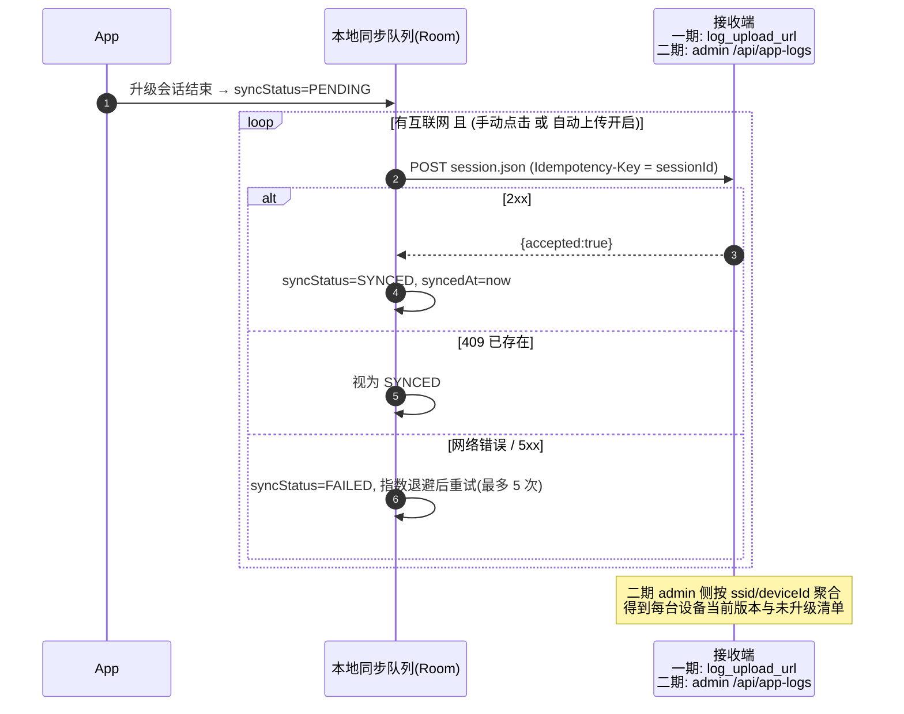
```mermaid
sequenceDiagram
    autonumber
    participant A as App
    participant Q as 本地同步队列(Room)
    participant S as 接收端<br/>一期: log_upload_url<br/>二期: admin /api/app-logs
    A->>Q: 升级会话结束 → syncStatus=PENDING
    loop 有互联网 且 (手动点击 或 自动上传开启)
        Q->>S: POST session.json (Idempotency-Key = sessionId)
        alt 2xx
            S-->>Q: {accepted:true}
            Q->>Q: syncStatus=SYNCED, syncedAt=now
        else 409 已存在
            Q->>Q: 视为 SYNCED
        else 网络错误 / 5xx
            Q->>Q: syncStatus=FAILED, 指数退避后重试(最多 5 次)
        end
    end
    Note over S: 二期 admin 侧按 ssid/deviceId 聚合<br/>得到每台设备当前版本与未升级清单
```

### 6.6 设置 / 设备配置项

所有设备侧参数集中在设置页，**首次安装内置默认值，拿到真实设备后由技术负责人确定并通过"导入配置 JSON"下发给所有手机**。

| 分组 | 配置项 key | 说明 | 默认值（占位） |
|---|---|---|---|
| Wi-Fi | `ssid_pattern` | 车辆设备 SSID 过滤规则（前缀 / 正则） | `^PDS-` |
| Wi-Fi | `wifi_password` | 设备 Wi-Fi 密码 | `********` |
| SSH | `ssh_host` | 设备固定 IP | `192.168.4.1` |
| SSH | `ssh_port` | SSH 端口 | `22` |
| SSH | `ssh_user` / `ssh_password` | 登录账号 / 密码 | `root` / `********` |
| SSH | `ssh_connect_timeout` | 连接超时 | `10 s` |
| 程序 | `target_dir` | 程序所在目录 | `/opt/pds/app` |
| 程序 | `target_file_name` | 单文件模式下的目标文件名（空 = 保持原名） | `pds_app` |
| 程序 | `tmp_dir` | 设备上传临时目录 | `/tmp/pds_upgrade` |
| 程序 | `backup_dir` / `backup_keep` | 备份目录 / 保留份数 | `/opt/pds/backup` / `3` |
| 命令 | `cmd_stop` | 停止程序 | `systemctl stop pds` |
| 命令 | `cmd_force_stop` | 强制停止 | `pkill -9 -f pds_app` |
| 命令 | `cmd_start` | 启动程序 | `systemctl start pds` |
| 命令 | `cmd_status` | 运行状态 | `systemctl is-active pds` |
| 命令 | `status_running_regex` | 运行中判定正则 | `^active` |
| 命令 | `cmd_version` | 读取版本 | `cat /opt/pds/app/VERSION` |
| 命令 | `version_regex` | 版本提取正则 | `v?(\d+\.\d+\.\d+)` |
| 校验 | `verify_delay` / `verify_stable_checks` / `verify_interval` | 启动后校验参数 | `5 s` / `3` / `3 s` |
| 程序包 | `allowed_extensions` / `min_size` / `max_size` | 校验参数 | `bin,zip,tar.gz` / `1 MB` / `2 GB` |
| 身份 | `identity_file` | 设备身份 / 配置文件路径（见 6.8） | `/opt/pds/app/config/device.conf` |
| 身份 | `identity_format` | 文件格式：`kv`（key=value）/ `json` / `yaml` | `kv` |
| 身份 | `identity_map` | 字段映射：`vehicleNo=vehicle_no;deviceId=device_id;ssid=wifi_ssid` | 见左 |
| 身份 | `identity_editable` | 是否允许在 App 内编辑身份（待业务确认，默认关） | `false` |
| 云端 | `version_manifest_url` | 版本清单 JSON 地址（6.2.4），空 = 隐藏云端版本 | 空 |
| 云端 | `log_upload_url` / `log_upload_token` / `log_auto_upload` | 日志上传接收端（6.5 F5-08） | 空 / 空 / `false` |
| 其他 | `operator_name` | 操作人姓名（写入日志） | 空 |
| 其他 | `debug_show_all_wifi` | 显示全部 Wi-Fi | `false` |

设置页需求：

| 编号 | 需求 | 优先级 |
|---|---|---|
| F6-01 | 分组展示、可编辑，敏感项默认隐藏显示 | P0 |
| F6-02 | 导出配置为 JSON / 从 JSON 导入（文件或扫二维码） | P0 |
| F6-03 | "测试连接"按钮：使用当前配置对已连接设备执行 S0+S1，展示结果 | P0 |
| F6-04 | 修改命令模板时展示占位符说明与预览 | P1 |
| F6-05 | 恢复默认 | P1 |
| F6-06 | 设置页可加简单口令锁（防止现场误改） | P2 |

### 6.7 界面语言与国际化（i18n）

#### 6.7.1 需求

| 编号 | 需求 | 优先级 |
|---|---|---|
| F7-01 | **App 所有界面文案使用英文**（菜单、按钮、提示、错误信息、步骤名称、空状态、系统通知栏文案），一期不提供中文界面 | P0 |
| F7-02 | 所有文案通过 Android 资源文件 `res/values/strings.xml` 集中管理，代码中不允许硬编码字符串；预留 `values-zh-rCN/` 目录结构，二期如需中文只需补充翻译文件 | P0 |
| F7-03 | 日志导出文件（txt / json / summary.csv）中的字段名、步骤名、结果枚举一律使用英文，与界面一致，便于跨团队阅读与后续 admin 聚合 | P0 |
| F7-04 | 日期时间格式：界面显示 `yyyy-MM-dd HH:mm:ss`（24 小时制，本地时区）；日志文件内使用 ISO 8601 含时区（如 `2026-09-30T09:41:12+08:00`） | P0 |
| F7-05 | 数字与单位：文件大小使用 `MB / GB`（保留 1 位小数），速度 `MB/s`，耗时 `1m 58s`；信号强度 `-62 dBm` | P1 |
| F7-06 | 文案风格：简短、动词开头（Start Upgrade / Retry / Export Logs）；错误提示采用"发生了什么 + 建议动作"两段式（如 *Device not responding. Check that the device is powered on and the IP/port in Settings is correct.*） | P1 |
| F7-07 | 英文文案需预留 30% 长度余量，按钮与列表项不得因文案过长截断；设置页配置项名称过长时允许两行显示 | P1 |
| F7-08 | 用户输入的内容（操作人姓名、备注）不做语言限制，支持中文输入与显示 | P0 |

#### 6.7.2 UI 术语对照表（研发与文案统一使用）

| 中文（PRD 用语） | 英文（界面用语） | 说明 |
|---|---|---|
| 设备 | Devices | 底部 Tab 1 |
| 程序包 | Packages | 底部 Tab 2 |
| 日志 | Logs | 底部 Tab 3 |
| 设置 | Settings | 底部 Tab 4 |
| 当前程序包 / 当前设备 | Current Package / Current Device | 设备页顶部状态卡 |
| 附近车辆设备 | Nearby Vehicles | 列表标题 |
| 已连接 / 就绪 / 无效 / 下载中 | Connected / Ready / Invalid / Downloading | 状态标签 |
| 连接 / 断开 / 刷新 | Connect / Disconnect / Refresh | 动作 |
| 手动输入 SSID | Enter SSID Manually | 兜底入口 |
| 设备详情 / 设备就绪 | Device Details / Device Ready | |
| 升级方案 | Upgrade Plan | 当前版本 → 目标版本 |
| 开始升级 / 取消升级 / 取消并回滚 | Start Upgrade / Cancel Upgrade / Cancel & Roll Back | |
| 升级中 | Upgrading | 页面标题 |
| 升级成功 | Upgrade Successful | 结果页（绿） |
| 升级失败，已恢复旧版本 | Upgrade Failed – Previous Version Restored | 结果页（橙） |
| 升级失败，需人工介入 | Upgrade Failed – Manual Intervention Required | 结果页（红） |
| 升级下一台 / 重试升级 | Upgrade Next Vehicle / Retry Upgrade | |
| 查看日志 / 导出日志 / 分享 | View Logs / Export Logs / Share | |
| URL 下载 / 本地文件 | Download from URL / Local File | |
| 清理缓存 | Clear Cache | |
| 会话日志 / 会话 ID | Session Log / Session ID | |
| 操作人 | Operator | |
| 测试连接 | Test Connection | 设置页 |
| 导入 / 导出配置 | Import / Export Config | |
| S0 建立连接 | S0 Connect | 升级步骤 |
| S1 环境预检 | S1 Pre-check | |
| S2 上传程序包 | S2 Upload Package | |
| S3 校验上传文件 | S3 Verify Upload | |
| S4 停止程序 | S4 Stop Service | |
| S5 备份旧版本 | S5 Back Up Current | |
| S6 替换程序文件 | S6 Replace Files | |
| S7 启动程序 | S7 Start Service | |
| S8 校验版本与运行状态 | S8 Verify Version & Status | |
| S9 清理临时文件 | S9 Clean Up | |
| RB 回滚 | RB Roll Back | |
| 结果枚举 | SUCCESS / FAILED_CLEAN / FAILED_RECOVERED / FAILED_MANUAL / CANCELLED / INTERRUPTED | 日志字段，界面显示为 Success / Failed / Failed (Rolled Back) / Needs Attention / Cancelled / Interrupted |
| 车号 / 设备 ID | Vehicle No. / Device ID | 设备身份卡 |
| 版本总览：云端 / 手机 / 设备 | Versions: Cloud / On Phone / On Device | 6.9 |
| 扫码连接 | Scan QR | 设备页 |
| 状态对账 | Checking device state… | 中断恢复页 |
| 上传到云端 / 同步状态 | Upload to Cloud / Local · Pending · Synced · Failed | 日志页 |

### 6.8 设备身份识别（业务方问题 1、2）

#### 6.8.1 背景

设备只有 SSID 对外可见，多台车停在一起时运维员分不清哪台是哪台（评审意见 2）。设备上的程序配置文件中记录了车号、设备 ID、SSID 等信息，App 连接后应把这些读出来展示，并缓存为"设备簿"供列表使用。

#### 6.8.2 需求

| 编号 | 需求 | 优先级 |
|---|---|---|
| F8-01 | SSH 探测成功后（6.1 的"设备就绪"阶段）自动读取 `identity_file`，按 `identity_format` / `identity_map` 解析出：车号（Vehicle No.）、设备 ID（Device ID）、SSID、以及文件中其他键值（原样列出，折叠显示） | P0 |
| F8-02 | 设备详情页顶部"Device Identity"卡片展示：车号（大字）、设备 ID、SSID、Wi-Fi MAC（BSSID，来自系统 API）、设备 IP；读取失败时显示"Identity unavailable"并给出原因（文件不存在 / 解析失败），不阻塞升级 | P0 |
| F8-03 | 本地设备簿（DeviceBook）：以 SSID 为主键缓存车号 / 设备 ID / 最近连接时间 / 最近版本；设备列表（F1-03）与日志列表都显示车号；扫码（F1-11）得到的车号也写入设备簿 | P0 |
| F8-04 | 一致性检查：若配置文件中的 SSID 与当前连接的 SSID 不一致，或设备簿中该 SSID 之前记录的车号与本次读到的不同，用黄色提示"Identity mismatch"，供人工核对（可能是设备被换车） | P1 |
| F8-05 | 身份信息写入升级会话日志（`vehicleNo` / `deviceId`），并作为二期 admin 关联设备台账的键 | P0 |
| F8-06 | **编辑身份（待业务确认）**：`identity_editable=true` 时，Device Identity 卡片出现"Edit"；可修改车号 / 设备 ID / SSID，保存流程：备份原文件 → 写入新值 → 校验回读 → 若修改了 SSID 则提示"设备 Wi-Fi 名称将在设备重启 / 网络服务重启后生效，App 将断开连接"，并提供"Restart Wi-Fi service"（`cmd_restart_wifi`，可配置）按钮。所有修改写入操作日志 | P2（待确认） |

> 关于 F8-06 的建议：车号 / 设备 ID 属于台账数据，如果二期由 admin 统一管理，建议 App 端只读，避免现场随意改动导致台账与设备不一致；如果现场确实需要（例如设备换车），建议只开放车号编辑，设备 ID 与 SSID 保持只读。请业务方确认。

#### 6.8.3 读取流程

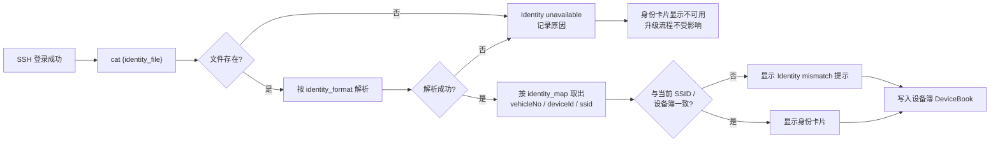
```mermaid
flowchart LR
    A[SSH 登录成功] --> B["cat {identity_file}"]
    B --> C{文件存在?}
    C -- 否 --> D[Identity unavailable<br/>记录原因]
    C -- 是 --> E[按 identity_format 解析]
    E --> F{解析成功?}
    F -- 否 --> D
    F -- 是 --> G[按 identity_map 取出<br/>vehicleNo / deviceId / ssid]
    G --> H{与当前 SSID /<br/>设备簿一致?}
    H -- 否 --> I[显示 Identity mismatch 提示]
    H -- 是 --> J[显示身份卡片]
    I & J --> K[写入设备簿 DeviceBook]
    D --> L[身份卡片显示不可用<br/>升级流程不受影响]
```

### 6.9 版本总览（业务方问题 3）

在**设备详情页**用一张卡片同时展示三个版本，并标出它们之间的关系，回答"该不该升、用哪个包升"：

| 列 | 英文 | 数据来源 | 无数据时 |
|---|---|---|---|
| 云端最新 | Cloud | `versions.json` 的 `latest`（6.2.4）；二期来自 admin 版本库 | `—`（未配置清单 / 无缓存），并提示 "Configure Cloud Versions in Settings" |
| 手机本地 | On Phone | 当前选中的程序包版本；未选中时显示本地缓存中最高版本 | `—` + "Download or select a package" |
| 已连接设备 | On Device | S1 读取的 `{cmd_version}` | `—` + "Connect to a device" |

状态判定与提示（基于三者比较）：

| 情况 | 卡片提示 | 主按钮 |
|---|---|---|
| Device == Phone == Cloud | "Up to date" | Start Upgrade 置灰（可强制重装） |
| Device < Phone == Cloud | "Upgrade available" | Start Upgrade |
| Device < Phone < Cloud | "A newer version is in the cloud. Download v1.4.0?" | Download latest / Upgrade with v1.3.0 |
| Device == Cloud，Phone 旧 | "Device is already on the latest version" | 置灰 |
| Phone 为空，Cloud 有 | "Download v1.3.0 to upgrade" | Download |
| Cloud 未知 | 只比较 Device 与 Phone | 按 6.3.1 表 |

同一张卡片在**程序包页**顶部以精简形式（Cloud / On Phone 两列）复用，方便在办公室提前下载。

---

## 7. 界面原型

可点击原型见同目录下的 `pds-app-prototype.html`（浏览器打开即可，手机框内点击导航）。原型界面文案为英文（与 6.7 一致），以下为各页面截图与中文说明。

### 7.1 信息架构

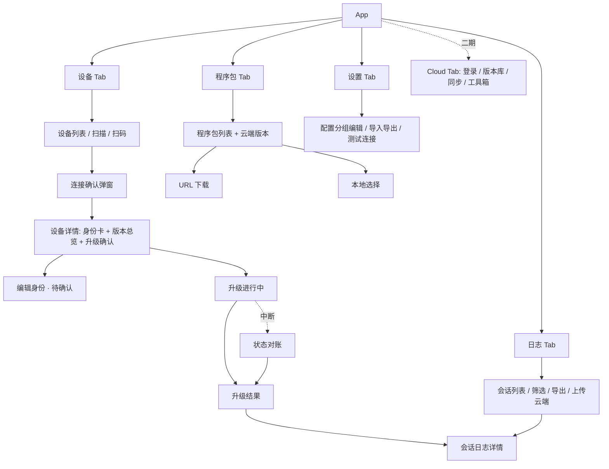
```mermaid
flowchart TD
    Root[App] --> Tab1[设备 Tab]
    Root --> Tab2[程序包 Tab]
    Root --> Tab3[日志 Tab]
    Root --> Tab4[设置 Tab]
    Tab1 --> P1[设备列表 / 扫描 / 扫码]
    P1 --> P2[连接确认弹窗]
    P2 --> P3[设备详情: 身份卡 + 版本总览 + 升级确认]
    P3 --> P12[编辑身份 · 待确认]
    P3 --> P4[升级进行中]
    P4 --> P5[升级结果]
    P4 -. 中断 .-> P13[状态对账]
    P13 --> P5
    P5 --> P6[会话日志详情]
    Tab2 --> P7[程序包列表 + 云端版本]
    P7 --> P8[URL 下载]
    P7 --> P9[本地选择]
    Tab3 --> P10[会话列表 / 筛选 / 导出 / 上传云端]
    P10 --> P6
    Tab4 --> P11[配置分组编辑 / 导入导出 / 测试连接]
    Root -. 二期 .-> Tab5[Cloud Tab: 登录 / 版本库 / 同步 / 工具箱]
```

### 7.2 页面截图

| 页面 | 截图 |
|---|---|
| 设备扫描列表 | 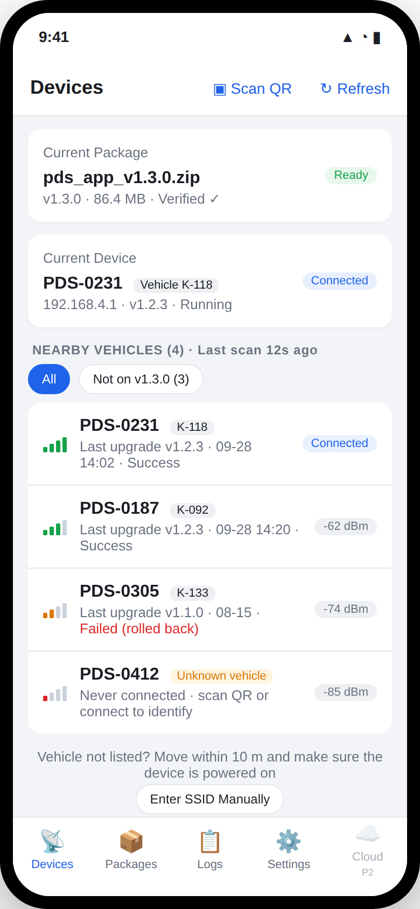 |
| 连接确认 | 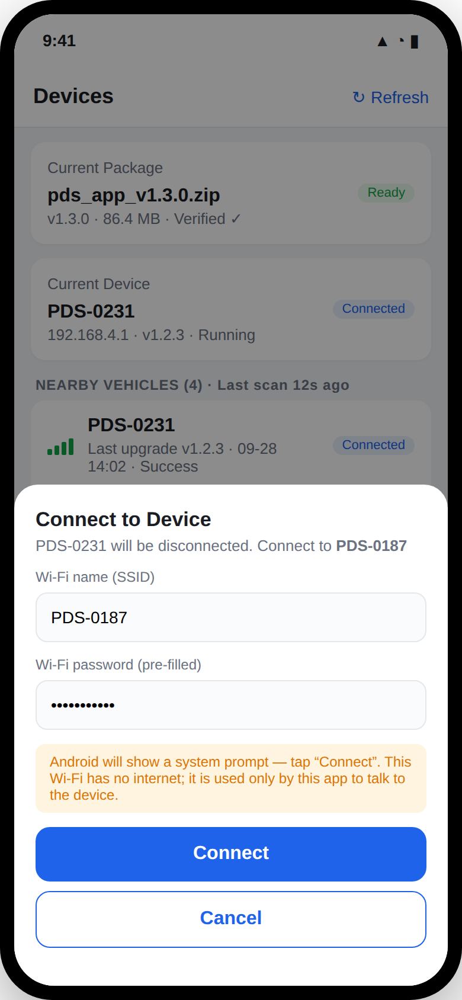 |
| 设备详情 / 升级确认 | 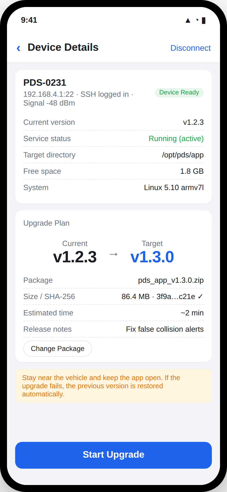 |
| 程序包列表 | 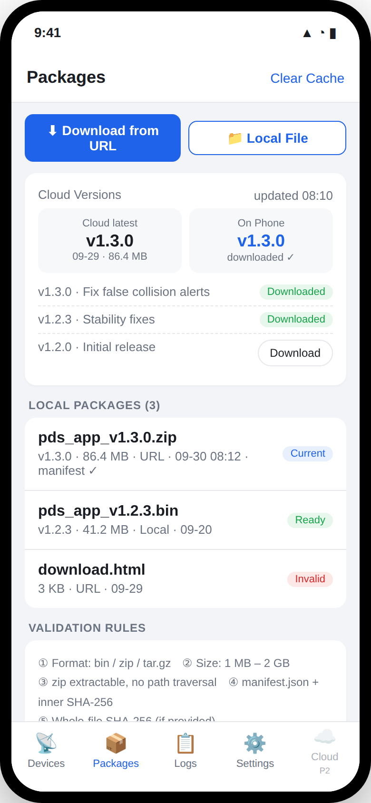 |
| URL 下载 | 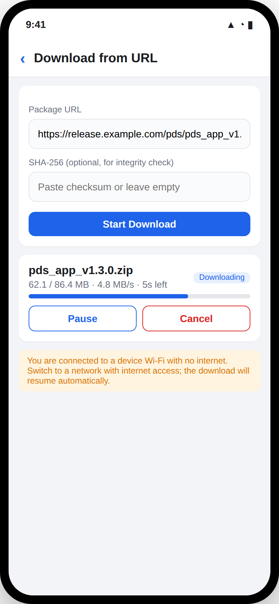 |
| 升级进行中 | 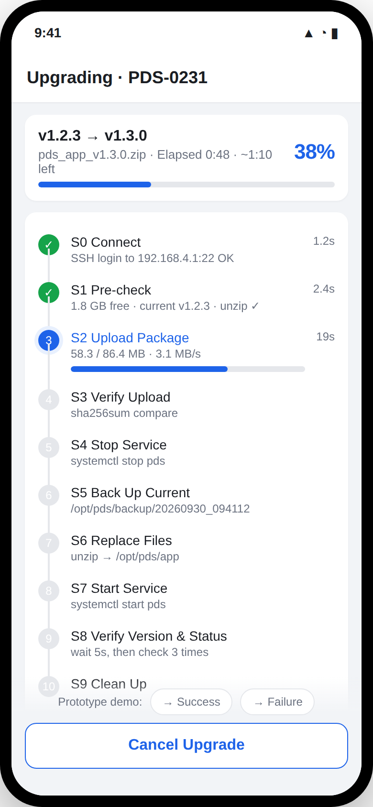 |
| 升级成功 | 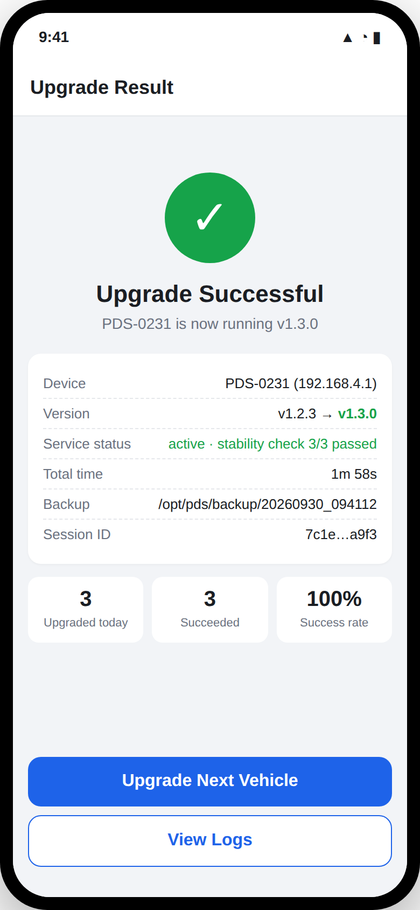 |
| 升级失败（已回滚） | 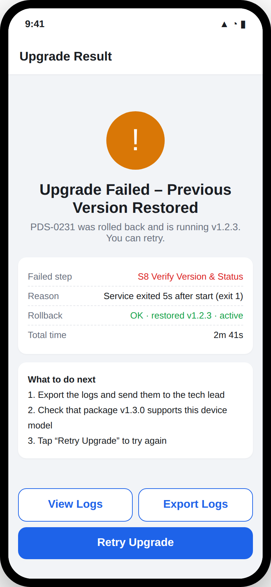 |
| 日志列表 | 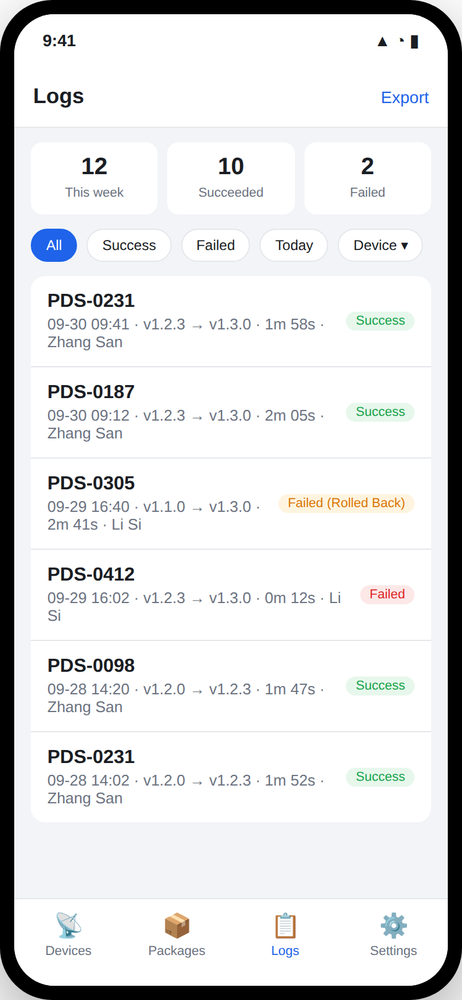 |
| 日志详情 | 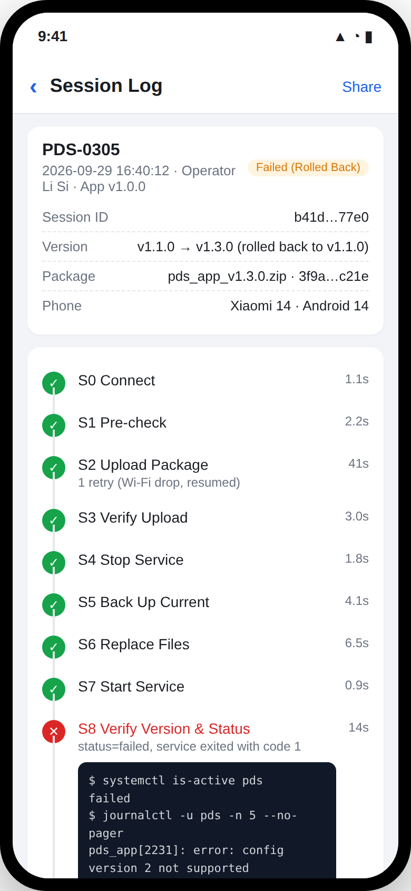 |
| 设置 | 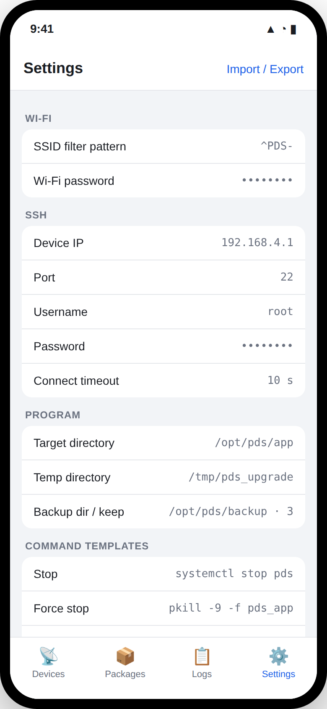 |
| 编辑设备身份（待确认功能） | 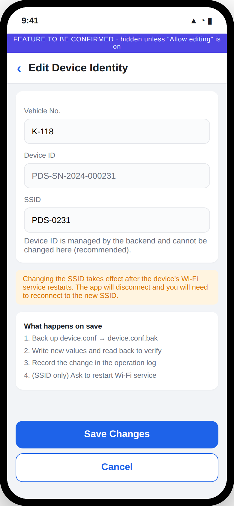 |
| 中断后状态对账 | 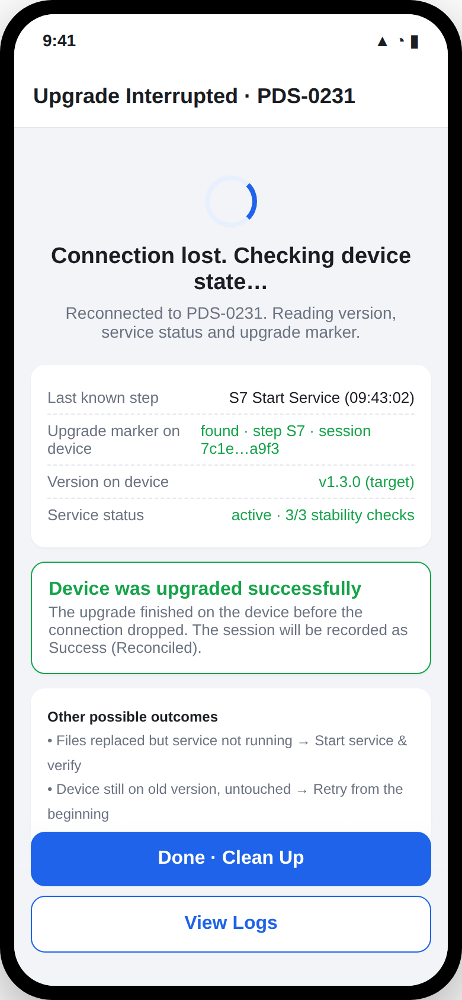 |
| Cloud Tab（二期预览） | 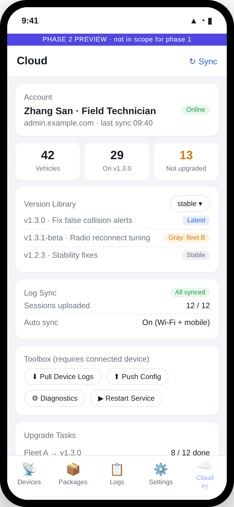 |

### 7.3 页面说明

**设备页**：顶部为"当前程序包"与"当前设备"两张状态卡，一眼看到"准备用什么包、升哪台车"。列表按信号强度排序，每项显示车号（来自设备簿）与最近一次升级版本，方便在停车场批量升级时区分"已升 / 未升"；右上角提供扫码连接。

**设备详情 / 升级确认页**：自上而下依次是 Device Identity（车号大字、设备 ID、SSID、MAC、IP）、Versions（Cloud / On Phone / On Device 三列 + 状态结论）、Upgrade Plan；"Start Upgrade"为整页唯一主操作，版本比对结论直接决定按钮是否可用。

**状态对账页**：连接中断后重新连上设备时出现，显示 App 正在读取设备实际版本 / 状态 / 升级标记文件，并给出结论与下一步按钮，避免"设备其实已经升好了但 App 报失败"。

**升级进行中页**：步骤时间线自上而下，当前步骤高亮并显示耗时，上传步骤带进度条；底部"取消"按钮在 S4 之后变为"取消并回滚"，需二次确认。

**结果页**：用颜色区分三种结局，并给出下一步动作按钮，让运维员不需要思考"接下来做什么"。

**日志页**：会话列表 + 顶部筛选 + 右上角"导出"；详情页每步可展开看原始命令输出。

**设置页**：分组折叠，敏感项掩码；底部"导入 / 导出配置"与"测试连接"。

---

## 8. 非功能需求

| 类别 | 需求 |
|---|---|
| 系统版本 | 建议 **Android 10（API 29）及以上**（`WifiNetworkSpecifier` 从 API 29 起可用，低版本连接方案不同，适配成本高）；重点适配 Android 12–15。最终最低版本待现场调研员工手机后确定（评审意见 7，见 Q9） |
| 语言 | 界面语言英文；字符串资源化，预留多语言目录（见 6.7） |
| 权限 | 定位（扫描 Wi-Fi）、附近设备（Android 13+）、通知（前台服务）、存储（SAF 方式无需全盘存储权限） |
| 安全 | 配置中的密码使用 Android Keystore 加密存储；日志脱敏；SSH 采用密码认证（设备现状），预留公钥认证配置；APK 签名内部管理 |
| 性能 | 扫描结果 2 s 内呈现；SFTP 上传速率不低于 Wi-Fi 链路的 70%；App 冷启动 ≤ 2 s |
| 可靠性 | 升级过程运行于前台服务；会话状态实时持久化（Room），任何中断可恢复或明确指导回滚 |
| 离线 | 除 URL 下载外所有功能不依赖互联网 |
| 可维护性 | 命令模板全部可配置；升级引擎步骤以插件化 Step 接口实现，便于二期扩展维护操作 |
| 分发 | 内部 APK 分发（飞书 / 内网下载页）；App 内"关于"页显示版本号；预留应用内检测更新（二期与 admin 对接） |

---

## 9. 技术方案建议（供研发评估）

| 领域 | 建议 |
|---|---|
| 语言 / 架构 | Kotlin + Jetpack Compose，MVVM + 单向数据流；模块划分：`wifi` / `package` / `upgrade` / `ssh` / `log` / `settings` / `sync`（二期） |
| Wi-Fi | `WifiNetworkSpecifier` + `ConnectivityManager.requestNetwork`；所有 socket 通过 `Network.socketFactory` 创建；扫描使用 `WifiManager.startScan` + `ScanResult` 过滤 |
| SSH / SFTP | `sshj`（推荐，支持 socketFactory 注入与 SFTP resume）或 `JSch`（轻量，需自行封装续传） |
| 升级引擎 | 定义 `UpgradeStep` 接口（`execute(ctx): StepResult`、`rollback(ctx)`、`timeout`、`retries`），引擎顺序驱动并持久化每步结果；运行在 `ForegroundService` + 协程 |
| 下载 | OkHttp + Range 断点续传；`WorkManager` 处理"等待有网自动继续" |
| 存储 | Room（sessions / steps / packages / devices）；程序包放 App 私有 `files/packages/`；日志导出用 `FileProvider` 分享 |
| 配置 | DataStore + Keystore 加密敏感项；JSON schema 版本化便于升级迁移 |
| 二期预留 | `sync` 模块接口先定义（`AdminApi`、`SyncQueue`），一期空实现 |

---

## 10. 二期方案（完整方案，本期不开发）

### 10.1 背景与目标

已有 admin 后台管理系统；设备程序通过电台通道上报 GPS / 告警等信息到 admin；admin 提供轨迹回放、告警报表。二期目标是把 App 从"孤立的升级工具"变为"admin 的移动端运维入口"，实现：

| 目标 | 衡量 |
|---|---|
| 版本从 admin 统一发布，现场零手工传包 | 运维员不再粘贴 URL / 拷文件；版本清单由 admin 自动生成 |
| 每台设备的版本状态在 admin 可见 | 升级日志离线同步后，admin 能列出"哪些设备还在旧版本" |
| App 成为通用运维工具 | 现场可拉取设备日志、下发配置，而不用带电脑 |
| 一期 App 平滑演进 | 二期只新增模块与一个 Tab，不推翻一期流程与数据结构 |

### 10.2 二期功能清单

| 编号 | 功能 | 描述 | 依赖 admin | 优先级 |
|---|---|---|---|---|
| P2-01 | 账号登录 | App 启动时用 admin 账号登录（用户名 + 密码 / 扫码登录），token 缓存，离线可继续使用一期全部功能；操作人姓名自动来自账号，替代一期手填 | 登录 / token 刷新接口；App 端权限角色（运维员 / 技术负责人） | P0 |
| P2-02 | 版本库 | admin 上传程序包并维护版本号、说明、sha256、适用设备型号、发布状态（草稿 / 灰度 / 正式 / 下线）；App 内 Cloud 页展示版本列表并直接下载；`versions.json` 由 admin 生成，一期 App 逻辑复用 | 版本管理模块 + 下载接口（支持 Range） | P0 |
| P2-03 | 灰度 / 定向发布 | admin 可指定"允许升级的车辆范围"（按车号 / 车队 / 设备型号）；App 在版本总览与确认页显示"该版本是否适用于当前设备"，不适用时阻止 | 版本 ↔ 设备范围规则 | P1 |
| P2-04 | 日志离线同步 | 一期 F5-08 的接收端替换为 admin 正式接口；自动同步（有网即传）；admin 聚合出每台设备当前版本、升级历史、成功率、未升级清单，并提供导出 | 日志接收接口 + 聚合报表 | P0 |
| P2-05 | 设备台账 | admin 维护车辆 ↔ 设备 ID ↔ SSID ↔ Wi-Fi MAC 的映射，可生成设备二维码（F1-11 格式）供打印粘贴；App 有网时同步台账到本地设备簿，离线也能在列表中显示车号 | 台账模块 + 二维码生成 | P0 |
| P2-06 | 设备身份编辑（承接 F8-06，待确认） | 若确认需要：编辑走 admin 审批或至少记录到台账变更历史；App 端编辑后自动把新值同步到 admin | 台账变更接口 | P2 |
| P2-07 | 设备维护工具箱 | 连接设备后可执行：① 拉取设备运行日志（SFTP 下载到手机 → 分享 / 上传 admin）；② 下发配置文件（从 admin 或手机本地选择 → 备份 → 替换 → 重启服务）；③ 预定义诊断命令（重启程序、查看状态、查看磁盘、查看最近 N 行日志）；④ 自定义命令（仅技术负责人角色，需二次确认）。所有操作复用升级引擎的 Step 框架与日志格式 | 主要为 App 侧；诊断命令模板可由 admin 下发 | P1 |
| P2-08 | App 自更新 | admin 管理 APK 版本；App 启动检测更新，提示下载安装（内部分发，非应用市场） | APK 分发接口 | P1 |
| P2-09 | 远程配置 | 一期设置页中的设备参数（IP / 端口 / 命令模板等）可由 admin 集中下发，避免每台手机手动导入 JSON | 配置下发接口 | P1 |
| P2-10 | 任务模式（预留） | admin 创建"升级任务"（版本 + 车辆清单），App 内领取任务，逐台完成后自动回传进度；admin 看任务完成率 | 任务模块 | P2 |
| P2-11 | 多语言（预留） | 补充 `values-zh-rCN` 翻译，设置中切换 | 无 | P2 |

### 10.3 二期系统架构

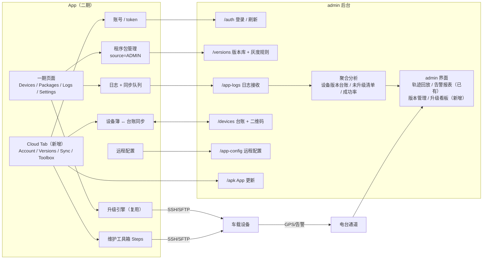
```mermaid
flowchart LR
    subgraph App["App（二期）"]
        UI1["一期页面<br/>Devices / Packages / Logs / Settings"]
        UI2["Cloud Tab（新增）<br/>Account / Versions / Sync / Toolbox"]
        UE["升级引擎（复用）"]
        TB["维护工具箱 Steps"]
        PM["程序包管理<br/>source=ADMIN"]
        DB["设备簿 ↔ 台账同步"]
        LOG["日志 + 同步队列"]
        AUTH["账号 / token"]
        RC["远程配置"]
    end
    subgraph Admin["admin 后台"]
        A1["/auth 登录 / 刷新"]
        A2["/versions 版本库 + 灰度规则"]
        A3["/app-logs 日志接收"]
        A4["/devices 台账 + 二维码"]
        A5["/app-config 远程配置"]
        A6["/apk App 更新"]
        AGG["聚合分析<br/>设备版本台账 / 未升级清单 / 成功率"]
        ADM["admin 界面<br/>轨迹回放 / 告警报表（已有）<br/>版本管理 / 升级看板（新增）"]
    end
    DEV["车载设备"]
    RADIO["电台通道"]

    AUTH --> A1
    PM --> A2
    LOG --> A3 --> AGG --> ADM
    DB <--> A4
    RC --> A5
    UI2 --> A6
    UE & TB -- SSH/SFTP --> DEV
    DEV -- GPS/告警 --> RADIO --> ADM
    UI1 --> UE & PM & LOG
    UI2 --> TB & AUTH & DB
```

### 10.4 二期端到端流程

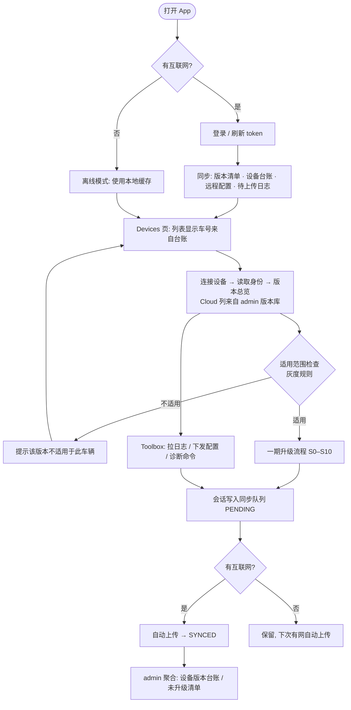
```mermaid
flowchart TD
    A([打开 App]) --> B{有互联网?}
    B -- 是 --> C[登录 / 刷新 token]
    C --> D[同步: 版本清单 · 设备台账 · 远程配置 · 待上传日志]
    B -- 否 --> E[离线模式: 使用本地缓存]
    D & E --> F[Devices 页: 列表显示车号来自台账]
    F --> G[连接设备 → 读取身份 → 版本总览<br/>Cloud 列来自 admin 版本库]
    G --> H{适用范围检查<br/>灰度规则}
    H -- 不适用 --> H1[提示该版本不适用于此车辆] --> F
    H -- 适用 --> I[一期升级流程 S0–S10]
    I --> J[会话写入同步队列 PENDING]
    G --> K[Toolbox: 拉日志 / 下发配置 / 诊断命令]
    K --> J
    J --> L{有互联网?}
    L -- 是 --> M[自动上传 → SYNCED]
    L -- 否 --> N[保留, 下次有网自动上传]
    M --> O[admin 聚合: 设备版本台账 / 未升级清单]
```

### 10.5 二期界面变化

| 位置 | 变化 |
|---|---|
| 底部 Tab | 新增第 5 个 Tab **Cloud**（登录状态、版本库、同步状态、工具箱入口）；一期 4 个 Tab 不变 |
| Devices 列表 | 车号来自 admin 台账（离线用设备簿缓存）；新增"Not on latest"筛选（数据来自台账 + 日志聚合）；支持从 admin 任务领取的车辆清单高亮（P2-10） |
| Device Details | Versions 卡片的 Cloud 列显示 admin 版本库的 latest，并显示"适用 / 不适用"标记；新增 **Toolbox** 区块（Pull Device Logs / Push Config / Diagnostics） |
| Packages | 顶部"Cloud Versions"列表替换为 admin 版本库（含灰度标签、适用型号）；URL 下载与本地文件入口保留为兜底 |
| Logs | 同步状态与"Upload to Cloud"由自动同步接管；新增"Synced to admin at …"；工具箱操作也作为会话出现在列表（type 字段区分 UPGRADE / TOOLBOX） |
| Settings | 新增 Account（登录 / 退出）、Server（admin 地址）、Auto sync 开关；设备参数改为"来自远程配置（可本地覆盖）" |
| 新页面 | Cloud 首页；版本详情；工具箱操作页（复用升级进行中页的步骤时间线）；任务列表（P2-10） |

原型中的 `ui-14-cloud-phase2.png` 为 Cloud Tab 的预览，仅用于对齐方向，二期启动时再细化。

### 10.6 admin 接口草案

| 接口 | 方法 | 说明 | 关键字段 |
|---|---|---|---|
| `/api/app/auth/login` | POST | 登录 | username, password → accessToken, refreshToken, role, operatorName |
| `/api/app/auth/refresh` | POST | 刷新 token | refreshToken |
| `/api/app/versions` | GET | 版本清单（与 6.2.4 `versions.json` 同结构，增加 `applicableTo` 范围规则） | ETag 缓存 |
| `/api/app/versions/{version}/download` | GET | 程序包下载 | 支持 Range；返回 sha256 头 |
| `/api/app/devices` | GET | 设备台账（增量：`since` 时间戳） | ssid, bssid, vehicleNo, deviceId, model, currentVersion(聚合), lastSeenAt |
| `/api/app/devices/{deviceId}/qrcode` | GET | 二维码内容 / 图片（F1-11 格式） | — |
| `/api/app/logs/sessions` | POST | 上传升级 / 工具箱会话（幂等：`Idempotency-Key: sessionId`） | UpgradeSession JSON（6.5.1） |
| `/api/app/logs/app` | POST | 上传 App 操作日志文件（可选，按天） | multipart |
| `/api/app/config` | GET | 远程配置（6.6 配置项 JSON） | version 号，App 本地可覆盖 |
| `/api/app/apk/latest` | GET | 最新 APK 版本与下载地址 | versionCode, url, sha256, notes, force |
| `/api/app/tasks` | GET / POST | 升级任务领取与进度回传（P2-10） | taskId, version, vehicles[], progress |

admin 侧聚合口径：以 `deviceId`（无则 `ssid`）为键，取最近一条 `result=SUCCESS` 会话的 `versionAfter` 作为"当前版本"；与版本库 `latest` 比较得到"未升级清单"；同时可结合电台通道上报的版本字段（如有）做交叉校验。

### 10.7 一期为二期预留的设计点

| 预留点 | 一期做法 |
|---|---|
| 程序包来源 | `Package.source` 枚举含 `ADMIN`；`RemoteSource` 接口一期实现 `UrlSource` 与 `ManifestSource`（versions.json），二期加 `AdminSource` |
| 版本清单格式 | 一期 `versions.json` 即二期 `/api/app/versions` 响应体，字段保持兼容 |
| 日志结构 | `UpgradeSession` 已含 `sessionId` / `ssid` / `vehicleNo` / `deviceId` / `operator` / `appVersion` / `syncStatus` / `syncedAt`；上传协议一期与二期一致（6.5.3） |
| 设备标识 | 设备簿以 SSID 为主键，字段含 `deviceId` / `vehicleNo` / `bssid`，二期直接被台账同步覆盖 |
| 网络层 | `AdminApi` 接口一期只有 `ManifestApi` / `LogUploadApi` 两个实现；`admin_base_url` 配置项预留 |
| 升级引擎 | `UpgradeStep` 插件化；工具箱操作 = 新的 Step 序列，复用执行、日志、中断对账框架 |
| 会话类型 | `UpgradeSession.type` 一期恒为 `UPGRADE`，二期加 `TOOLBOX_PULL_LOGS` / `TOOLBOX_PUSH_CONFIG` / `TOOLBOX_COMMAND` |
| 身份编辑 | `identity_editable` 开关与 F8-06 流程一期已设计，二期决定是否开放 |
| 界面 | 底部 Tab 容器预留第 5 个位置；Device Details 页面为可扩展的卡片列表，工具箱区块直接追加 |
| 配置 | 设置项 JSON schema 版本化，远程配置下发时按 schema 合并 |

### 10.8 二期待定问题

- admin 侧 SSID / 设备 ID 与车辆的映射由谁维护、如何初始化（导入现有台账 / 现场扫码登记）；
- 日志同步是否需要传设备控制台原文（L2）还是仅结构化摘要（体积与隐私权衡）；
- 灰度规则粒度（车队 / 车型 / 指定车号）；
- 工具箱自定义命令是否允许、由哪个角色执行、是否需要 admin 审计；
- 是否需要多语言与多租户（多个矿区）；
- App 登录是否接入现有 admin 的账号体系（SSO / 独立账号）。

---

## 11. 验收标准（一期）

| 编号 | 场景 | 通过标准 |
|---|---|---|
| AC-01 | 扫描与连接 | 在 3 台设备同时开机的环境下，App 列表正确显示 3 个 SSID，任选一台可在 15 s 内连接并显示当前版本 |
| AC-02 | 切换设备 | 从 A 切换到 B，A 断开、B 连接成功，界面状态正确 |
| AC-03 | URL 下载 | 100 MB 程序包可下载、断网后恢复续传、校验通过 |
| AC-04 | 本地文件 | 从手机文件管理器选择 zip 与单文件，均可导入并校验 |
| AC-05 | 校验拦截 | 3 KB 的错误文件、损坏 zip、扩展名不允许的文件均被拦截并有明确提示 |
| AC-06 | 正常升级 | 单文件与 zip 两种包各完成一次升级，设备上版本与运行状态正确，App 提示成功 |
| AC-07 | 回滚 | 人为构造启动失败的程序包，升级后自动回滚，设备恢复旧版本运行，App 提示"失败已恢复" |
| AC-08 | 中断恢复 | 上传阶段关闭 Wi-Fi 后重新打开，升级自动续传完成 |
| AC-09 | App 被杀 | 升级中强杀 App，重新打开后提示未完成会话并可检查 / 回滚 |
| AC-10 | 日志 | 上述每次操作均有完整会话日志；导出 zip 可用微信 / 飞书分享，内容含每步命令输出且密码脱敏 |
| AC-11 | 配置 | 修改 IP / 命令后"测试连接"结果随之变化；导出 JSON 在另一台手机导入后行为一致 |
| AC-12 | 语言 | 全部界面、通知栏、错误提示与导出日志均为英文，无中文残留；`strings.xml` 中无未使用 / 硬编码字符串（lint 通过） |
| AC-13 | 设备身份 | 连接后 3 s 内显示车号 / 设备 ID / SSID；断开重连后列表仍显示车号（设备簿缓存）；配置文件缺失时显示不可用且升级不受影响 |
| AC-14 | 版本总览 | 配置版本清单后，设备详情页正确显示 Cloud / On Phone / On Device 三个版本并给出正确结论（覆盖 6.9 表中 5 种情况） |
| AC-15 | 扫码连接 | 扫描按 F1-11 格式生成的二维码可直接连接隐藏 SSID 的设备 |
| AC-16 | 中断对账 | 在 S6–S8 阶段强制断开 Wi-Fi 使设备自行完成启动，重连后 App 判定为 Success (Reconciled) 而非失败；在 S2 阶段断开则判定为未改动可重试 |
| AC-17 | 日志上传 | 配置接收端后，点击 Upload 将 PENDING 会话上传并标 SYNCED；重复上传不产生重复记录；断网时标 FAILED 并在恢复后自动重试 |

---

## 12. 待确认问题（拿到设备后补充）

| 编号 | 问题 | 影响 |
|---|---|---|
| Q1 | 设备 SSID 命名规则（前缀 / 格式） | `ssid_pattern` 默认值 |
| Q2 | 设备 IP、SSH 端口、账号密码、Wi-Fi 密码 | 配置默认值 |
| Q3 | 程序目录、程序文件名、是单文件还是目录 | `target_dir` / 包格式规范 |
| Q4 | 程序如何启停（systemd / init 脚本 / 直接 nohup）、进程名 | `cmd_start` / `cmd_stop` / `cmd_status` |
| Q5 | 如何读取程序版本号（文件 / 命令参数 `--version` / 日志） | `cmd_version` / `version_regex` |
| Q6 | 设备是否有 unzip / sha256sum / rsync；磁盘剩余空间量级 | 包格式（zip vs tar）、S1 预检 |
| Q7 | 设备 Wi-Fi 是否隐藏 SSID、是否 2.4G/5G、同时连接数上限 | 连接方案 |
| Q8 | 程序包典型大小、发版频率 | 缓存上限、性能指标 |
| Q9 | 现场使用的手机型号与 Android 版本 | 适配基线 |
| Q10 | 程序是否有开机自启（影响回滚与断电风险评估） | 回滚策略 |
| Q11 | 是否允许 App 在设备上写入备份目录（磁盘空间） | `backup_dir` / `backup_keep` |
| Q12 | 是否需要在升级前检查车辆状态（如车辆行驶中禁止升级） | 是否增加前置确认 |
| Q13 | 设备身份配置文件的路径、格式、字段名（车号 / 设备 ID / SSID 分别叫什么） | `identity_file` / `identity_map` 默认值 |
| Q14 | **是否允许在 App 内编辑车号 / 设备 ID / SSID**；若允许，修改 SSID 后设备如何生效（重启 Wi-Fi 服务命令） | F8-06 是否进入一期 |
| Q15 | 一期版本清单 `versions.json` 与程序包放在哪里（对象存储 / 内网 Nginx），由谁维护 | `version_manifest_url` |
| Q16 | 一期日志上传接收端是否需要（可先只做导出），若需要由谁提供 | F5-08 是否进入一期 |
| Q17 | 设备是否有 watchdog / 开机自启会在升级中途自动拉起程序（影响 S4 停止逻辑与对账判定） | `cmd_stop` 需同时停 watchdog |
| Q18 | 现场员工手机型号 / Android 版本调研结果 | 最低支持版本 |

---

## 附录 A. 评审意见处理记录（2026-09-30，评审人：宋家强）

| # | 评审意见 | 处理 | 落点 |
|---|---|---|---|
| 1 | 需要少量后端服务：最新版本信息、安装包列表、下载地址 | 一期采用静态 `versions.json` + 程序包下载地址，无需开发接口；二期由 admin 版本库生成同格式 | 2.2、6.2.4、F2-09/10、10.2 P2-02 |
| 2 | 多台设备混在一起只能看到 Wi-Fi 名，分不清哪台，数量多时不好排查哪台没升级 | 连接后读取设备配置文件得到车号 / 设备 ID 并缓存为设备簿，列表显示车号；新增"未升级"筛选；二期由 admin 台账 + 日志聚合给出未升级清单 | 6.8、F1-03、F1-12、10.2 P2-04/05 |
| 3 | 支持隐藏 Wi-Fi 需要 MAC 地址，可做二维码贴在设备上扫码读取 | 新增扫码连接，二维码含 SSID / BSSID / 车号 / 设备 ID；二期 admin 生成二维码 | F1-11、10.6 |
| 4 | 日志分为 App 操作日志（含 App-服务器、App-设备交互）与 SSH 控制台日志两部分 | 日志分层为 L1 操作日志 + L2 设备控制台日志，升级会话把两者串起来；导出与上传格式据此调整 | 6.5.0 |
| 5 | 手机被打断失去连接，设备可能已升级成功但 App 不知道，重连后显示失败吗？ | 新增设备端升级标记文件 + 重连后状态对账流程，能判定"其实已成功"；状态机新增 Interrupted / Reconciling | 6.3.2、6.3.3、F3-09、E11/E12/E16 |
| 6 | 升级前是否做版本检查，提示已是最新 / 与设备一致是否继续 | 升级前版本比对改为必做，5 种情况分别提示；新增版本总览卡片 | 6.3.1、6.9 |
| 7 | 确认最低 Android 版本，现场调研员工手机 | 建议 Android 10+（Specifier API 要求），最终以调研结果为准 | 第 8 章、Q18 |
| 8 | Wi-Fi 抢断：部分 Android 会断开无互联网 Wi-Fi 自动连其他，流程上要求其他 Wi-Fi 不自动连接 | 技术上用 Specifier 绑定 + onLost 自动重连；流程上首次引导与手册要求关闭其他 Wi-Fi 自动连接与智能切换；设置页提供检查入口 | F1-13、E12 |

业务方问题处理：

| # | 问题 | 处理 | 落点 |
|---|---|---|---|
| B1 | 连上后读取 PDS 配置文件，显示车号、ID、SSID | 设备身份识别功能 | 6.8 |
| B2 | 是否需要编辑车号 / ID / SSID（待确认） | 设计为可配置开关的 P2 功能，附建议（只读或仅车号可改），等待业务确认 | F8-06、Q14、10.2 P2-06 |
| B3 | 一个界面清晰显示云上版本 / 手机版本 / 已连接 PDS 版本 | 设备详情页 Versions 卡片（Cloud / On Phone / On Device）+ 状态结论 | 6.9 |
| B4 | 日志如何上传到云上 | 一期：可配置 HTTPS 接收端 + 同步队列 + 幂等上传；二期：admin 正式接口 + 自动同步 + 聚合 | F5-08、6.5.3、10.2 P2-04、10.6 |
