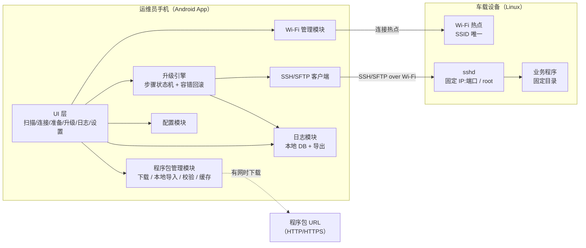
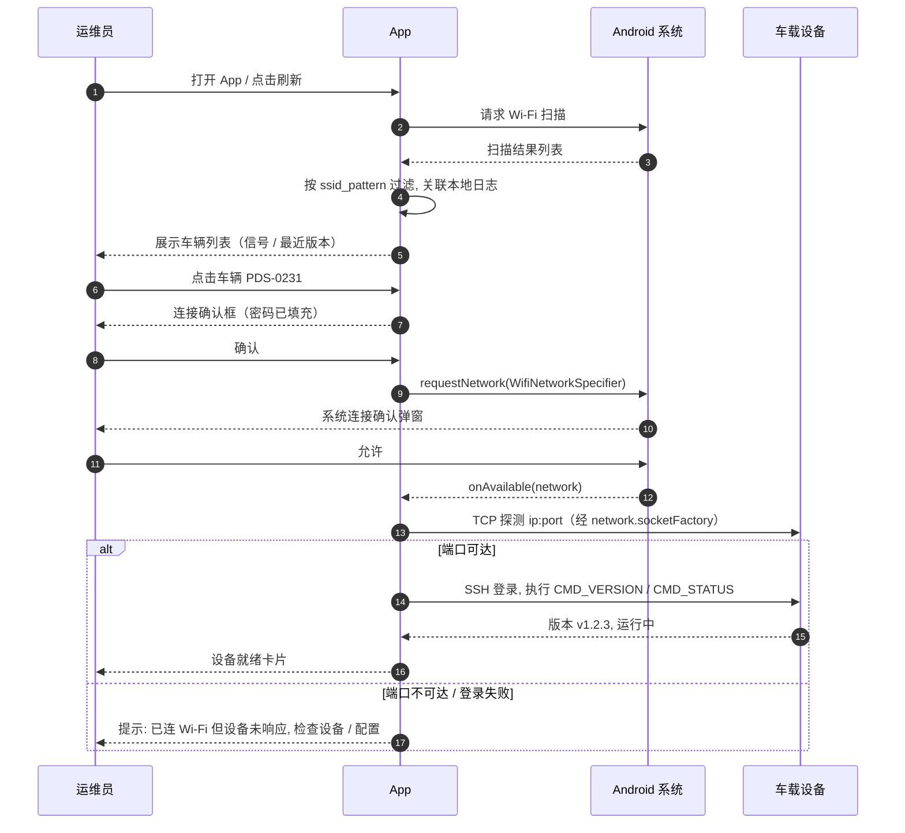
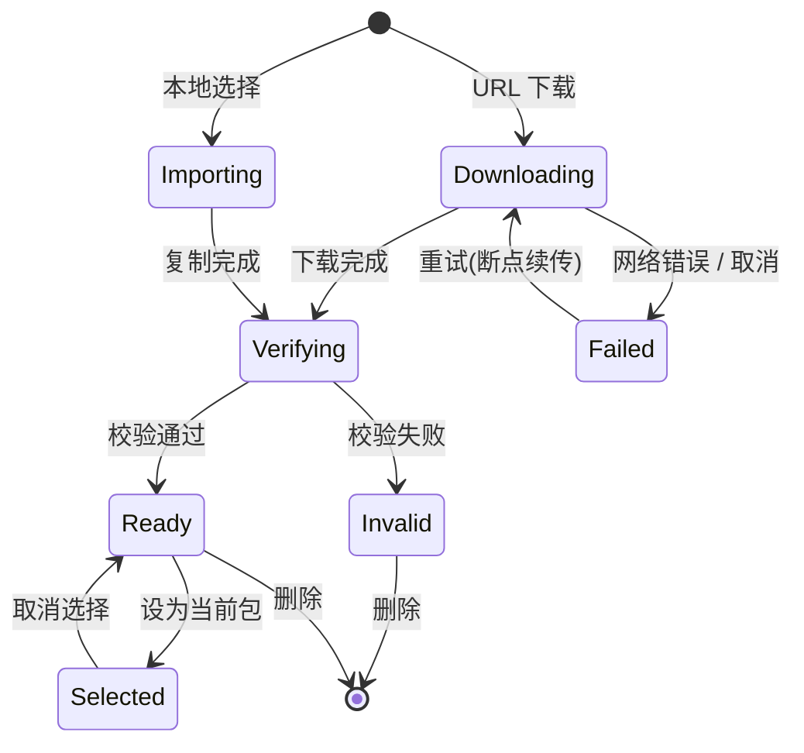
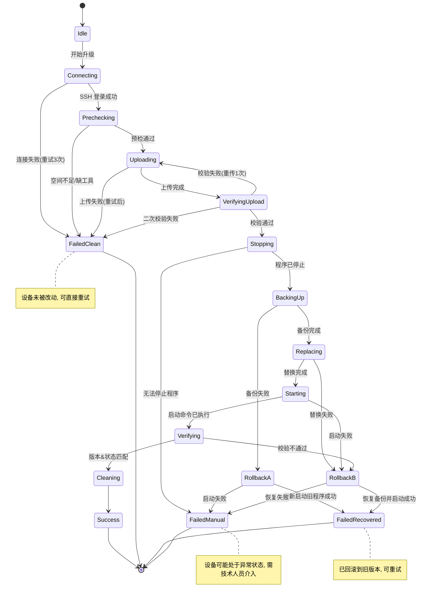
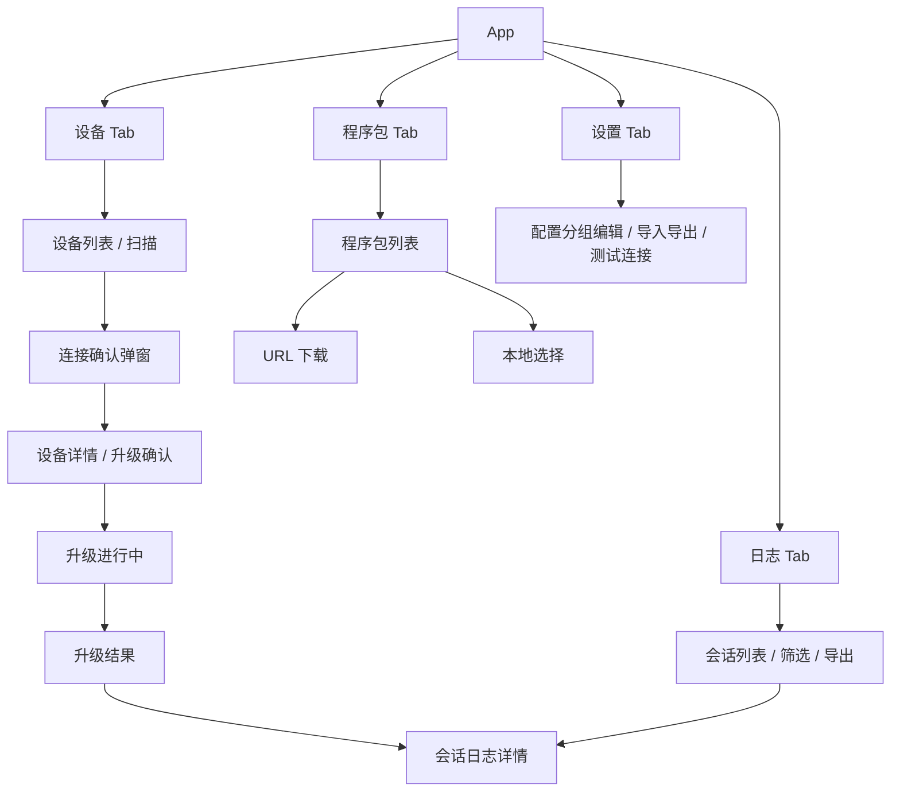
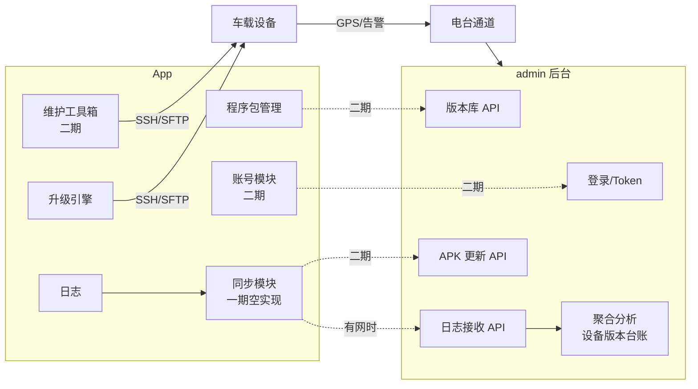

# 矿区车载安全设备程序升级 App（PDS-APP）产品需求文档

| 项目 | 内容 |
|---|---|
| 文档版本 | v1.1 |
| 状态 | 草稿 / 待评审 |
| 作者 | Vic Guo |
| 日期 | 2026-09-30 |
| 目标平台 | Android（不上架应用市场，内部分发 APK） |
| App 界面语言 | 英文（English），见 6.7 |
| 配套文件 | `prototype/pds-app-prototype.html`（可点击原型）、`docs/images/`（流程图与界面截图） |

## 修订记录

| 版本 | 日期 | 修订人 | 说明 |
|---|---|---|---|
| v1.0 | 2026-09-30 | Vic Guo | 初稿：一期完整需求 + 二期预留方案 |
| v1.1 | 2026-09-30 | Vic Guo | 新增 6.7 界面语言与国际化需求；原型与截图全部改为英文界面；补充 UI 术语对照表 |

---

## 1. 背景与问题

矿区每台车辆上安装了一台车载安全设备（碰撞预警等功能）。设备为 Linux 系统，自带 Wi-Fi 热点（覆盖约 10 m），支持 SSH 连接与控制。所有设备的 IP、SSH 端口、root 账号密码、Wi-Fi 密码完全一致，仅 Wi-Fi 名称（SSID）不同，用于区分车辆。

设备上运行一个业务程序，需要频繁进行版本升级。当前升级方式为：

1. 操作人员携带电脑到车旁，连接设备 Wi-Fi；
2. 通过 SSH 登录设备；
3. 停止当前运行程序；
4. 进入固定目录替换程序文件；
5. 重新启动程序，人工确认。

### 1.1 现状痛点

| 痛点 | 影响 |
|---|---|
| 操作人员需要掌握 SSH 命令 | 只有少数技术人员能执行，升级排期受限 |
| 步骤多、手工操作 | 容易漏步骤 / 输错命令，导致程序无法启动 |
| 必须携带电脑 | 矿区现场环境恶劣，携带电脑不便 |
| 无操作记录 | 无法追溯"哪台车升到了哪个版本、谁在什么时候升的、失败原因是什么" |

### 1.2 产品定位

一款面向矿区现场运维人员的 Android 工具类 App，用手机替代电脑，把"连 Wi-Fi → SSH → 停程序 → 替换文件 → 启程序 → 校验"整条链路封装为**一键升级**，并完整记录每台设备的升级日志。

---

## 2. 目标与范围

### 2.1 产品目标

| 编号 | 目标 | 衡量方式 |
|---|---|---|
| G1 | 非技术人员可独立完成升级 | 操作人员不需要输入任何命令；培训 10 分钟内上手 |
| G2 | 单台设备升级耗时可控 | 从连接 Wi-Fi 到提示成功 ≤ 3 分钟（100 MB 程序包，实际取决于 Wi-Fi 速率） |
| G3 | 升级过程可靠、可恢复 | 任一步失败可自动回滚到升级前状态，设备不会因升级失败而"变砖" |
| G4 | 升级过程可追溯 | 每台设备每次升级都有完整日志并可导出 |

### 2.2 分期范围

| 分期 | 范围 | 投入 |
|---|---|---|
| **一期（本 PRD 主体）** | 设备扫描连接、程序包准备（URL 下载 / 本地文件）、一键自动升级、结果校验、日志记录与导出、设备参数配置 | 仅 App 开发，不依赖后端改造 |
| **二期（仅做方案预留，本期不开发）** | 对接 admin 后台：自动登录、版本库下载、日志离线同步、设备维护工具（文件导入 / 导出等） | App + admin 后端 |

### 2.3 一期非目标（明确不做）

- 不做 iOS 版本；
- 不上架应用市场，不做账号体系（二期与 admin 对接时补充）；
- 不做设备程序的编译 / 打包，App 只负责分发已经打好的程序包；
- 不做多台设备并行升级（Android 一次只能连接一个 Wi-Fi，一期为串行逐台升级）；
- 不做设备端 Agent 改造，一期完全基于设备现有的 SSH 能力。

---

## 3. 用户与使用场景

### 3.1 目标用户

| 角色 | 描述 | 诉求 |
|---|---|---|
| 现场运维员（主要用户） | 矿区现场人员，负责巡检、设备维护，不一定懂 Linux | 少操作、少思考、看得懂提示、出错知道怎么办 |
| 技术负责人 | 研发 / 实施工程师，负责发布程序版本、排查升级失败 | 能配置设备参数、能拿到详细日志定位问题 |

### 3.2 核心场景

**场景 A：单车升级**
运维员拿到新版本下载链接（或已把程序包拷到手机），走到车旁打开 App，扫描到该车 Wi-Fi 并连接，选择程序包，点击"开始升级"，等待提示成功。

**场景 B：停车场多车批量升级**
多台车停在一起，运维员依次切换连接不同车辆的 Wi-Fi，重复升级流程。程序包只需准备一次，App 记录每台车的结果，最后可以在日志页看到"本次共升级 N 台，成功 M 台"。

**场景 C：升级失败排查**
某台车升级失败，运维员在 App 内查看该次升级日志，把日志导出并通过微信 / 飞书发给技术负责人。技术负责人根据日志中的每一步命令输出定位问题。

**场景 D：无网络环境**
矿区没有移动网络。运维员在有网的地方（办公室）提前通过 URL 下载好程序包缓存在 App 内，到现场直接使用本地已下载的包。

---

## 4. 术语

| 术语 | 说明 |
|---|---|
| 设备 / 车载设备 | 安装在车上的 Linux 安全设备 |
| SSID | 设备发射的 Wi-Fi 名称，每台车唯一，作为设备标识 |
| 程序包 | 待部署到设备上的程序文件，可能是单文件或文件夹（打包为 zip） |
| 升级会话（Session） | 对一台设备执行一次完整升级的过程，拥有唯一 ID，对应一份日志 |
| 目标目录 | 设备上程序所在的固定目录 |
| 配置项 | 设备侧固定参数（IP、端口、账号、目录、启停命令等），在 App 设置页维护 |

---

## 5. 整体方案

### 5.1 系统架构（一期）



### 5.2 一期 App 功能模块

| 模块 | 职责 |
|---|---|
| 设备扫描与连接 | 扫描附近 Wi-Fi，按 SSID 规则过滤出车辆设备，一键连接（密码默认填充），显示连接状态与信号强度，支持切换设备 |
| 程序包管理 | 支持 URL 下载与本地文件选择；统一为"程序包"对象；校验格式、大小、完整性；本地缓存与历史列表 |
| 升级引擎 | 按固定步骤序列对当前连接设备执行升级；每一步有超时、重试、失败分支；支持自动回滚 |
| 结果校验 | 读取设备上的程序版本与运行状态，与预期对比，给出明确的成功 / 失败提示 |
| 日志 | 记录每个升级会话的每一步：时间、命令、输出、耗时、结果；支持按设备 / 时间筛选；支持导出为文本 / zip 并通过系统分享 |
| 设置 | 维护设备配置项（IP、端口、账号密码、Wi-Fi 密码、SSID 前缀、目录、命令模板、超时）；配置可导入 / 导出 JSON，方便多台手机统一配置 |

### 5.3 端到端主流程


---

## 6. 一期功能需求

### 6.1 设备扫描与连接

#### 6.1.1 功能描述

| 编号 | 需求 | 优先级 |
|---|---|---|
| F1-01 | App 启动进入"设备"页，自动触发一次 Wi-Fi 扫描，并提供手动"刷新"按钮 | P0 |
| F1-02 | 扫描结果按 SSID 规则过滤（配置项 `ssid_pattern`，如前缀 `PDS-`），仅展示车辆设备；提供"显示全部 Wi-Fi"开关用于调试 | P0 |
| F1-03 | 列表每项展示：SSID、信号强度（4 格图标 + dBm）、是否已连接、最近一次升级结果与版本（来自本地日志） | P0 |
| F1-04 | 点击列表项 → 弹出连接确认（SSID、密码已默认填充可修改）→ 连接 | P0 |
| F1-05 | 连接过程中展示进度：正在连接 → 已连接 Wi-Fi → 正在探测设备（SSH 端口）→ 设备就绪（显示当前版本） | P0 |
| F1-06 | 已连接状态下，顶部常驻"当前设备卡片"：SSID、IP、当前程序版本、运行状态、断开按钮 | P0 |
| F1-07 | 切换设备：点击其他车辆时提示"将断开 XX 并连接 YY"，确认后自动断开再连接 | P0 |
| F1-08 | 升级进行中禁止切换 / 断开设备，需先取消升级 | P0 |
| F1-09 | 首次使用引导：申请定位权限 / 附近设备权限，并解释原因（Android 扫描 Wi-Fi 必须） | P0 |
| F1-10 | 手动输入 SSID 连接（应对隐藏 SSID 或扫描节流的兜底） | P1 |

#### 6.1.2 Android 平台约束（研发注意）

| 约束 | 说明 | 方案 |
|---|---|---|
| Wi-Fi 扫描需要定位权限 | Android 9+ 扫描需 `ACCESS_FINE_LOCATION` 且定位开关打开；Android 13+ 可用 `NEARBY_WIFI_DEVICES` | 首次引导申请；定位未开启时给出跳转设置的提示 |
| 扫描节流 | Android 9+ 前台 App 每 2 分钟最多 4 次扫描 | 刷新按钮加倒计时防抖；缓存上次扫描结果并标注时间 |
| Android 10+ 不能直接代用户连 Wi-Fi | 需使用 `WifiNetworkSpecifier` + `ConnectivityManager.requestNetwork`，系统弹出确认框；该连接仅本 App 可用，不影响手机移动数据 | 一期采用此方案；SSH 连接必须通过返回的 `Network` 对象创建 socket（`network.socketFactory`），否则流量可能走移动网络 |
| 设备热点无互联网 | 系统可能判定"无网络"并自动切回其他 Wi-Fi | 使用 Specifier 方式绑定网络可避免；文档中提示用户"连接期间不要关闭 App" |
| 手机型号差异 | 部分国产 ROM 对 Specifier 支持有差异 | 一期指定 1–2 款测试机型作为验收基线；预留"手动去系统设置连接 Wi-Fi 后回 App"的兜底路径 |

#### 6.1.3 连接流程图



### 6.2 程序包准备

#### 6.2.1 程序包统一模型

为了同时支持"单文件"和"文件夹"两种形态并可闭环，App 内统一抽象为 `Package` 对象：

```
Package
├── id              本地唯一 ID
├── name            展示名（默认取文件名）
├── source          来源: URL / LOCAL /（二期）ADMIN
├── sourceRef       URL 地址 或 本地 URI
├── kind            SINGLE_FILE | ARCHIVE(zip)
├── localPath       App 私有目录中的缓存路径
├── size            字节数
├── sha256          整包 SHA-256
├── version         版本号（来自 manifest / 文件名 / 用户输入）
├── manifest        可选, 解析自 zip 内 manifest.json
├── status          DOWNLOADING | READY | INVALID
└── createdAt
```

**程序包格式规范（建议与研发 / 发版方约定）**

| 形态 | 规范 | App 处理方式 |
|---|---|---|
| 单文件 | 任意可执行文件 / 二进制，如 `pds_app_v1.3.0.bin` | 直接上传到目标目录，文件名由配置项 `target_file_name` 决定（或保持原名） |
| 文件夹 | 打包为 zip（`pds_app_v1.3.0.zip`），根目录建议包含 `manifest.json` | App 上传 zip 后在设备上 `unzip` 到临时目录再整体替换目标目录 |

`manifest.json`（可选，有则优先使用其中的信息）：

```json
{
  "name": "pds_app",
  "version": "1.3.0",
  "targetDir": "/opt/pds/app",
  "entry": "pds_app",
  "sha256": { "pds_app": "…", "config/default.yaml": "…" },
  "minAppVersion": "1.0.0",
  "preStop": null,
  "postStart": null,
  "notes": "修复碰撞预警误报"
}
```

无 manifest 时：版本号从文件名中按正则 `v?(\d+\.\d+\.\d+)` 提取，提取不到则要求用户手动填写；目标目录使用设置中的默认值。

#### 6.2.2 功能需求

| 编号 | 需求 | 优先级 |
|---|---|---|
| F2-01 | 进入"程序包"页可看到本地已缓存的程序包列表（名称、版本、大小、来源、时间、校验状态） | P0 |
| F2-02 | **URL 下载**：输入 / 粘贴 URL → 显示下载进度（速度、剩余）→ 完成后自动校验；支持暂停 / 取消 / 断点续传（HTTP Range） | P0 |
| F2-03 | **本地文件选择**：调用系统文件选择器（SAF）选择单文件或 zip；复制到 App 私有目录后校验 | P0 |
| F2-04 | **校验规则**：① 扩展名 / 魔数在允许列表（配置项 `allowed_extensions`）；② 大小在 `min_size`~`max_size` 范围；③ zip 可正常解压、无路径穿越；④ 若有 manifest 则校验 manifest 格式与内部 sha256；⑤ 若 URL 旁提供 `.sha256` 文件或用户粘贴了摘要则比对整包 sha256 | P0 |
| F2-05 | 校验失败明确提示原因（如"文件大小 3 KB，疑似下载了错误页面"），并将状态标为 INVALID | P0 |
| F2-06 | 选中一个 READY 状态的程序包作为"当前待升级包"，在设备页 / 升级页顶部显示 | P0 |
| F2-07 | 删除程序包、清理缓存；缓存总量上限（配置项，默认 2 GB） | P1 |
| F2-08 | 下载时若手机当前连接的是设备 Wi-Fi（无互联网），提示"当前网络无法访问互联网，请切换网络后下载"，并保留任务待网络恢复自动继续 | P1 |

#### 6.2.3 程序包状态流转



### 6.3 一键升级（核心）

#### 6.3.1 前置条件

- 已连接某台车辆 Wi-Fi 且设备探测成功（SSH 可登录）；
- 已选择一个 READY 状态的程序包；
- 手机电量 ≥ 20%（低于时警告但不阻止）。

升级确认页展示：设备 SSID、设备当前版本 → 目标版本、程序包名称与大小、预计耗时、目标目录；用户点击"开始升级"后进入自动流程，期间保持屏幕常亮，并以前台服务（Foreground Service）方式运行，防止 App 被系统回收。

#### 6.3.2 升级步骤序列

每一步定义：命令模板（占位符来自配置项）、超时、失败策略。**所有命令模板均为可配置项，拿到真实设备后再确定默认值。**

| 步骤 | 名称 | 动作（命令模板示例） | 超时 | 失败策略 |
|---|---|---|---|---|
| S0 | 建立连接 | TCP 连接 `{ip}:{port}` → SSH 密码登录 `{user}/{password}` | 10 s，重试 3 次 | 终止（未改动设备，可直接重试） |
| S1 | 环境预检 | `uname -a`；`df -Pk {target_dir}` 检查剩余空间 ≥ 程序包 × 2；`which unzip sha256sum`；`{cmd_version}` 读取当前版本；`{cmd_status}` 读取运行状态 | 15 s | 终止（空间不足 / 缺工具时明确提示） |
| S2 | 上传程序包 | SFTP 上传到 `{tmp_dir}/{session_id}/`；显示进度 | 按大小动态（≥ 60 s） | 重试 2 次；仍失败则清理临时目录后终止 |
| S3 | 校验上传 | `sha256sum {tmp_file}` 与本地对比；zip 则 `unzip -t` 测试 | 30 s | 回到 S2 重传 1 次，仍失败终止 |
| S4 | 停止程序 | `{cmd_stop}`（如 `systemctl stop pds` 或 `pkill -f pds_app`）；轮询 `{cmd_status}` 直到停止 | 20 s | 超时执行 `{cmd_force_stop}`（`pkill -9`）；仍未停止 → 终止并标记"需人工介入" |
| S5 | 备份旧版本 | `mkdir -p {backup_dir}/{ts} && cp -a {target_dir}/. {backup_dir}/{ts}/` | 30 s | 终止 → 执行 `{cmd_start}` 恢复运行（阶段 A 回滚） |
| S6 | 替换文件 | 单文件：`cp {tmp_file} {target_dir}/{target_file_name} && chmod +x`；zip：`unzip -o {tmp_file} -d {tmp_dir}/{session_id}/extract && rsync -a --delete {extract}/ {target_dir}/`（无 rsync 则 `rm -rf` + `cp -a`） | 60 s | 触发**回滚**（阶段 B） |
| S7 | 启动程序 | `{cmd_start}`；`sync` | 20 s | 触发回滚 |
| S8 | 结果校验 | 等待 `{verify_delay}`（默认 5 s）后执行 `{cmd_status}` 与 `{cmd_version}`；要求：进程运行中 且 版本号 == 目标版本；可选：连续 3 次间隔 3 s 检查进程仍存活（防止启动后崩溃） | 30 s | 触发回滚 |
| S9 | 清理 | 删除 `{tmp_dir}/{session_id}`；按 `backup_keep` 保留最近 N 份备份 | 15 s | 仅记录警告，不影响成功结论 |
| S10 | 断开 | 关闭 SSH；记录总耗时；写日志 | — | — |

**回滚（Rollback）流程**：`{cmd_stop}` → `rm -rf {target_dir}/*` → `cp -a {backup_dir}/{ts}/. {target_dir}/` → `{cmd_start}` → `{cmd_status}` + `{cmd_version}` 校验为旧版本。回滚成功 → 结果"失败（已恢复旧版本）"；回滚失败 → 结果"失败（设备异常，需人工介入）"，并在日志中标红。

#### 6.3.3 升级状态机



#### 6.3.4 升级过程 UI 需求

| 编号 | 需求 | 优先级 |
|---|---|---|
| F3-01 | 步骤列表（S0–S10）逐项展示状态：待执行 / 进行中（带耗时）/ 成功 / 失败 / 跳过；上传步骤显示进度条与速度 | P0 |
| F3-02 | 顶部总进度与预计剩余时间 | P1 |
| F3-03 | "取消"按钮：S0–S3 阶段可安全取消（清理临时文件）；S4 之后取消 = 触发回滚，需二次确认 | P0 |
| F3-04 | 升级中屏幕常亮、前台服务通知栏常驻；用户切到后台再回来状态保持 | P0 |
| F3-05 | 升级中检测到 Wi-Fi 断开：暂停并尝试自动重连（最多 60 s）；重连成功后从当前步骤幂等恢复（S2 续传 / S4 之后重新进入校验或回滚判断）；重连失败 → 标记"中断"，指导用户重新连接后选择"继续 / 回滚" | P0 |
| F3-06 | 每一步的命令与设备输出可展开查看（技术人员用），默认折叠 | P1 |
| F3-07 | 结果页：成功（绿）/ 失败已恢复（橙）/ 失败需人工（红）三种；显示升级前后版本、总耗时、失败步骤与原因摘要；按钮："查看日志"、"重试"、"升级下一台" | P0 |
| F3-08 | 目标版本 == 当前版本时提示"设备已是该版本"，允许用户选择"强制重装" | P1 |

#### 6.3.5 异常场景与容错清单

| 编号 | 场景 | 检测方式 | 处理 | 用户提示 |
|---|---|---|---|---|
| E01 | 已连 Wi-Fi 但 SSH 端口不通 | S0 TCP 超时 | 重试 3 次 | "设备未响应，请确认设备已开机 / 配置中的 IP 端口正确" |
| E02 | SSH 密码错误 | 认证失败 | 不重试 | "登录失败，请检查设置中的账号密码" |
| E03 | 设备磁盘空间不足 | S1 df | 终止 | "设备剩余空间 X MB，不足以升级（需要 Y MB）" |
| E04 | 设备缺少 unzip / sha256sum | S1 which | zip 包终止；单文件可跳过 sha256 校验并记录警告 | "设备缺少 unzip 工具，无法部署文件夹类型程序包" |
| E05 | 上传中断（Wi-Fi 抖动） | SFTP 异常 | 自动重连 + 续传（SFTP resume）2 次 | "上传中断，正在重试（2/2）" |
| E06 | 上传后校验不一致 | S3 | 重传 1 次 | — |
| E07 | 程序无法停止 | S4 轮询超时 | force stop；仍失败终止（未改动文件） | "无法停止设备程序，请联系技术人员" |
| E08 | 备份失败 | S5 | 重启旧程序 | "备份失败，已恢复运行，升级未执行" |
| E09 | 替换 / 启动 / 校验失败 | S6–S8 | 回滚 B | "升级失败，已自动恢复到 v1.2.3" |
| E10 | 回滚失败 | 回滚校验 | 标记需人工 | "设备状态异常，请勿断电，联系技术人员并导出日志" |
| E11 | 升级中 App 被杀 / 手机重启 | 前台服务 + 会话持久化 | 下次打开 App 检测到未完成会话，提示用户连接同一设备后选择"检查设备状态 / 回滚" | "上次对 PDS-0231 的升级未完成" |
| E12 | 升级中用户切换 Wi-Fi / 断开 | F3-05 | 同 E05 逻辑 | — |
| E13 | 版本命令输出格式与预期不符 | S8 正则不匹配 | 视为校验失败 → 回滚；技术人员可在设置中调整 `version_regex` | "无法识别设备版本输出" |
| E14 | 目标版本低于当前版本（降级） | 确认页比较 | 允许但提示确认 | "目标版本低于当前版本，确定降级？" |
| E15 | 手机存储不足 | 下载 / 导入前检查 | 阻止 | "手机剩余空间不足" |

### 6.4 结果校验与提示

| 编号 | 需求 | 优先级 |
|---|---|---|
| F4-01 | 校验规则：`{cmd_status}` 输出匹配 `status_running_regex` 且 `{cmd_version}` 输出经 `version_regex` 提取的版本 == 目标版本 | P0 |
| F4-02 | 可选稳定性校验：启动后 `verify_stable_checks` 次（默认 3）间隔 `verify_interval`（默认 3 s）检查进程仍存活 | P1 |
| F4-03 | 成功后更新设备页列表中该 SSID 的"最近版本 / 最近升级时间 / 结果"标记 | P0 |
| F4-04 | 成功 / 失败均震动 + 提示音（现场噪音大） | P1 |

### 6.5 日志记录与导出

#### 6.5.1 日志模型

```
UpgradeSession
├── sessionId          UUID
├── ssid               设备标识
├── deviceIp
├── packageId / packageName / packageVersion / packageSha256
├── versionBefore / versionAfter
├── startedAt / endedAt / durationMs
├── result             SUCCESS | FAILED_CLEAN | FAILED_RECOVERED | FAILED_MANUAL | CANCELLED | INTERRUPTED
├── failedStep / failReason
├── appVersion / phoneModel / androidVersion
├── operator           一期：设置页中填写的操作人姓名（可空）
└── steps[]            StepLog
      ├── stepCode     S0…S10 / RB（回滚）
      ├── name
      ├── status       SUCCESS | FAILED | SKIPPED | CANCELLED
      ├── startedAt / durationMs
      ├── attempts     重试次数
      ├── command      实际执行的命令（密码脱敏）
      ├── stdout / stderr（截断上限 64 KB/步）
      └── exitCode
```

另有 App 级运行日志（Wi-Fi 扫描 / 连接、下载、崩溃）按天滚动保存，最多保留 30 天。

#### 6.5.2 功能需求

| 编号 | 需求 | 优先级 |
|---|---|---|
| F5-01 | "日志"页按升级会话列表展示：时间、SSID、版本变化、结果（颜色标识）、耗时；支持按 SSID / 结果 / 日期筛选与搜索 | P0 |
| F5-02 | 会话详情：会话摘要 + 步骤时间线，每步可展开命令与输出 | P0 |
| F5-03 | 导出单个会话：生成 `PDS_<SSID>_<yyyyMMdd_HHmmss>_<result>.txt`（人类可读）+ `.json`（结构化） | P0 |
| F5-04 | 批量导出：按筛选条件导出为 zip（内含各会话 txt/json + `summary.csv`），通过系统分享（微信 / 飞书 / 邮件）或保存到 Downloads | P0 |
| F5-05 | 日志中所有密码字段脱敏为 `******` | P0 |
| F5-06 | 日志存储上限（默认 500 个会话或 200 MB），超限按时间 FIFO 清理并提示 | P1 |
| F5-07 | 统计卡片：今日 / 本次 App 启动以来升级台数、成功率 | P2 |

### 6.6 设置 / 设备配置项

所有设备侧参数集中在设置页，**首次安装内置默认值，拿到真实设备后由技术负责人确定并通过"导入配置 JSON"下发给所有手机**。

| 分组 | 配置项 key | 说明 | 默认值（占位） |
|---|---|---|---|
| Wi-Fi | `ssid_pattern` | 车辆设备 SSID 过滤规则（前缀 / 正则） | `^PDS-` |
| Wi-Fi | `wifi_password` | 设备 Wi-Fi 密码 | `********` |
| SSH | `ssh_host` | 设备固定 IP | `192.168.4.1` |
| SSH | `ssh_port` | SSH 端口 | `22` |
| SSH | `ssh_user` / `ssh_password` | 登录账号 / 密码 | `root` / `********` |
| SSH | `ssh_connect_timeout` | 连接超时 | `10 s` |
| 程序 | `target_dir` | 程序所在目录 | `/opt/pds/app` |
| 程序 | `target_file_name` | 单文件模式下的目标文件名（空 = 保持原名） | `pds_app` |
| 程序 | `tmp_dir` | 设备上传临时目录 | `/tmp/pds_upgrade` |
| 程序 | `backup_dir` / `backup_keep` | 备份目录 / 保留份数 | `/opt/pds/backup` / `3` |
| 命令 | `cmd_stop` | 停止程序 | `systemctl stop pds` |
| 命令 | `cmd_force_stop` | 强制停止 | `pkill -9 -f pds_app` |
| 命令 | `cmd_start` | 启动程序 | `systemctl start pds` |
| 命令 | `cmd_status` | 运行状态 | `systemctl is-active pds` |
| 命令 | `status_running_regex` | 运行中判定正则 | `^active` |
| 命令 | `cmd_version` | 读取版本 | `cat /opt/pds/app/VERSION` |
| 命令 | `version_regex` | 版本提取正则 | `v?(\d+\.\d+\.\d+)` |
| 校验 | `verify_delay` / `verify_stable_checks` / `verify_interval` | 启动后校验参数 | `5 s` / `3` / `3 s` |
| 程序包 | `allowed_extensions` / `min_size` / `max_size` | 校验参数 | `bin,zip,tar.gz` / `1 MB` / `2 GB` |
| 其他 | `operator_name` | 操作人姓名（写入日志） | 空 |
| 其他 | `debug_show_all_wifi` | 显示全部 Wi-Fi | `false` |

设置页需求：

| 编号 | 需求 | 优先级 |
|---|---|---|
| F6-01 | 分组展示、可编辑，敏感项默认隐藏显示 | P0 |
| F6-02 | 导出配置为 JSON / 从 JSON 导入（文件或扫二维码） | P0 |
| F6-03 | "测试连接"按钮：使用当前配置对已连接设备执行 S0+S1，展示结果 | P0 |
| F6-04 | 修改命令模板时展示占位符说明与预览 | P1 |
| F6-05 | 恢复默认 | P1 |
| F6-06 | 设置页可加简单口令锁（防止现场误改） | P2 |

### 6.7 界面语言与国际化（i18n）

#### 6.7.1 需求

| 编号 | 需求 | 优先级 |
|---|---|---|
| F7-01 | **App 所有界面文案使用英文**（菜单、按钮、提示、错误信息、步骤名称、空状态、系统通知栏文案），一期不提供中文界面 | P0 |
| F7-02 | 所有文案通过 Android 资源文件 `res/values/strings.xml` 集中管理，代码中不允许硬编码字符串；预留 `values-zh-rCN/` 目录结构，二期如需中文只需补充翻译文件 | P0 |
| F7-03 | 日志导出文件（txt / json / summary.csv）中的字段名、步骤名、结果枚举一律使用英文，与界面一致，便于跨团队阅读与后续 admin 聚合 | P0 |
| F7-04 | 日期时间格式：界面显示 `yyyy-MM-dd HH:mm:ss`（24 小时制，本地时区）；日志文件内使用 ISO 8601 含时区（如 `2026-09-30T09:41:12+08:00`） | P0 |
| F7-05 | 数字与单位：文件大小使用 `MB / GB`（保留 1 位小数），速度 `MB/s`，耗时 `1m 58s`；信号强度 `-62 dBm` | P1 |
| F7-06 | 文案风格：简短、动词开头（Start Upgrade / Retry / Export Logs）；错误提示采用"发生了什么 + 建议动作"两段式（如 *Device not responding. Check that the device is powered on and the IP/port in Settings is correct.*） | P1 |
| F7-07 | 英文文案需预留 30% 长度余量，按钮与列表项不得因文案过长截断；设置页配置项名称过长时允许两行显示 | P1 |
| F7-08 | 用户输入的内容（操作人姓名、备注）不做语言限制，支持中文输入与显示 | P0 |

#### 6.7.2 UI 术语对照表（研发与文案统一使用）

| 中文（PRD 用语） | 英文（界面用语） | 说明 |
|---|---|---|
| 设备 | Devices | 底部 Tab 1 |
| 程序包 | Packages | 底部 Tab 2 |
| 日志 | Logs | 底部 Tab 3 |
| 设置 | Settings | 底部 Tab 4 |
| 当前程序包 / 当前设备 | Current Package / Current Device | 设备页顶部状态卡 |
| 附近车辆设备 | Nearby Vehicles | 列表标题 |
| 已连接 / 就绪 / 无效 / 下载中 | Connected / Ready / Invalid / Downloading | 状态标签 |
| 连接 / 断开 / 刷新 | Connect / Disconnect / Refresh | 动作 |
| 手动输入 SSID | Enter SSID Manually | 兜底入口 |
| 设备详情 / 设备就绪 | Device Details / Device Ready | |
| 升级方案 | Upgrade Plan | 当前版本 → 目标版本 |
| 开始升级 / 取消升级 / 取消并回滚 | Start Upgrade / Cancel Upgrade / Cancel & Roll Back | |
| 升级中 | Upgrading | 页面标题 |
| 升级成功 | Upgrade Successful | 结果页（绿） |
| 升级失败，已恢复旧版本 | Upgrade Failed – Previous Version Restored | 结果页（橙） |
| 升级失败，需人工介入 | Upgrade Failed – Manual Intervention Required | 结果页（红） |
| 升级下一台 / 重试升级 | Upgrade Next Vehicle / Retry Upgrade | |
| 查看日志 / 导出日志 / 分享 | View Logs / Export Logs / Share | |
| URL 下载 / 本地文件 | Download from URL / Local File | |
| 清理缓存 | Clear Cache | |
| 会话日志 / 会话 ID | Session Log / Session ID | |
| 操作人 | Operator | |
| 测试连接 | Test Connection | 设置页 |
| 导入 / 导出配置 | Import / Export Config | |
| S0 建立连接 | S0 Connect | 升级步骤 |
| S1 环境预检 | S1 Pre-check | |
| S2 上传程序包 | S2 Upload Package | |
| S3 校验上传文件 | S3 Verify Upload | |
| S4 停止程序 | S4 Stop Service | |
| S5 备份旧版本 | S5 Back Up Current | |
| S6 替换程序文件 | S6 Replace Files | |
| S7 启动程序 | S7 Start Service | |
| S8 校验版本与运行状态 | S8 Verify Version & Status | |
| S9 清理临时文件 | S9 Clean Up | |
| RB 回滚 | RB Roll Back | |
| 结果枚举 | SUCCESS / FAILED_CLEAN / FAILED_RECOVERED / FAILED_MANUAL / CANCELLED / INTERRUPTED | 日志字段，界面显示为 Success / Failed / Failed (Rolled Back) / Needs Attention / Cancelled / Interrupted |

---

## 7. 界面原型

可点击原型见 `prototype/pds-app-prototype.html`（浏览器打开即可，手机框内点击导航）。原型界面文案为英文（与 6.7 一致），以下为各页面截图与中文说明。

### 7.1 信息架构



### 7.2 页面截图

| 页面 | 截图 |
|---|---|
| 设备扫描列表 |  |
| 连接确认 |  |
| 设备详情 / 升级确认 |  |
| 程序包列表 |  |
| URL 下载 |  |
| 升级进行中 |  |
| 升级成功 |  |
| 升级失败（已回滚） |  |
| 日志列表 |  |
| 日志详情 |  |
| 设置 |  |

### 7.3 页面说明

**设备页**：顶部为"当前程序包"与"当前设备"两张状态卡，一眼看到"准备用什么包、升哪台车"。列表按信号强度排序，每项右侧显示该车最近一次升级版本，方便在停车场批量升级时区分"已升 / 未升"。

**升级确认页**：把"当前版本 → 目标版本"用大字号放在最显眼位置，避免升错包；"开始升级"按钮为整页唯一主操作。

**升级进行中页**：步骤时间线自上而下，当前步骤高亮并显示耗时，上传步骤带进度条；底部"取消"按钮在 S4 之后变为"取消并回滚"，需二次确认。

**结果页**：用颜色区分三种结局，并给出下一步动作按钮，让运维员不需要思考"接下来做什么"。

**日志页**：会话列表 + 顶部筛选 + 右上角"导出"；详情页每步可展开看原始命令输出。

**设置页**：分组折叠，敏感项掩码；底部"导入 / 导出配置"与"测试连接"。

---

## 8. 非功能需求

| 类别 | 需求 |
|---|---|
| 系统版本 | Android 8.0（API 26）及以上；重点适配 Android 10–14 |
| 语言 | 界面语言英文；字符串资源化，预留多语言目录（见 6.7） |
| 权限 | 定位（扫描 Wi-Fi）、附近设备（Android 13+）、通知（前台服务）、存储（SAF 方式无需全盘存储权限） |
| 安全 | 配置中的密码使用 Android Keystore 加密存储；日志脱敏；SSH 采用密码认证（设备现状），预留公钥认证配置；APK 签名内部管理 |
| 性能 | 扫描结果 2 s 内呈现；SFTP 上传速率不低于 Wi-Fi 链路的 70%；App 冷启动 ≤ 2 s |
| 可靠性 | 升级过程运行于前台服务；会话状态实时持久化（Room），任何中断可恢复或明确指导回滚 |
| 离线 | 除 URL 下载外所有功能不依赖互联网 |
| 可维护性 | 命令模板全部可配置；升级引擎步骤以插件化 Step 接口实现，便于二期扩展维护操作 |
| 分发 | 内部 APK 分发（飞书 / 内网下载页）；App 内"关于"页显示版本号；预留应用内检测更新（二期与 admin 对接） |

---

## 9. 技术方案建议（供研发评估）

| 领域 | 建议 |
|---|---|
| 语言 / 架构 | Kotlin + Jetpack Compose，MVVM + 单向数据流；模块划分：`wifi` / `package` / `upgrade` / `ssh` / `log` / `settings` / `sync`（二期） |
| Wi-Fi | `WifiNetworkSpecifier` + `ConnectivityManager.requestNetwork`；所有 socket 通过 `Network.socketFactory` 创建；扫描使用 `WifiManager.startScan` + `ScanResult` 过滤 |
| SSH / SFTP | `sshj`（推荐，支持 socketFactory 注入与 SFTP resume）或 `JSch`（轻量，需自行封装续传） |
| 升级引擎 | 定义 `UpgradeStep` 接口（`execute(ctx): StepResult`、`rollback(ctx)`、`timeout`、`retries`），引擎顺序驱动并持久化每步结果；运行在 `ForegroundService` + 协程 |
| 下载 | OkHttp + Range 断点续传；`WorkManager` 处理"等待有网自动继续" |
| 存储 | Room（sessions / steps / packages / devices）；程序包放 App 私有 `files/packages/`；日志导出用 `FileProvider` 分享 |
| 配置 | DataStore + Keystore 加密敏感项；JSON schema 版本化便于升级迁移 |
| 二期预留 | `sync` 模块接口先定义（`AdminApi`、`SyncQueue`），一期空实现 |

---

## 10. 二期规划（仅方案预留，不开发）

### 10.1 背景

已有 admin 后台管理系统；设备程序通过电台通道上报 GPS / 告警等信息到 admin；admin 提供轨迹回放、告警报表。二期目标是把 App 从"孤立工具"变为"admin 的移动端运维入口"。

### 10.2 二期功能方向

| 方向 | 描述 | 依赖 |
|---|---|---|
| P2-01 账号与登录 | App 启动自动连接 admin，使用 admin 账号登录（token 缓存，离线可用） | admin 提供登录 / token 刷新接口 |
| P2-02 版本库 | admin 上传并管理程序版本（版本号、说明、sha256、适用设备型号、发布状态）；App 内直接浏览并下载对应版本，替代手动粘贴 URL / 选本地文件 | admin 版本管理模块 + 下载接口 |
| P2-03 日志离线同步 | App 内升级日志在有网时自动上传 admin；admin 聚合出"每台设备当前版本、未升级设备清单、升级成功率" | admin 日志接收接口 + 设备台账关联（SSID ↔ 车辆） |
| P2-04 设备维护工具箱 | 连接设备后可执行：设备运行日志文件导出（SFTP 拉取到手机 → 分享 / 上传 admin）、文件导入（配置文件下发）、预定义诊断命令（重启程序、查看状态）、其他后续设计 | 主要为 App 侧扩展 |
| P2-05 App 自更新 | admin 管理 APK 版本，App 内检测更新 | admin APK 分发接口 |

### 10.3 二期架构预留



**一期为二期预留的设计点**

| 预留点 | 一期做法 |
|---|---|
| 程序包来源 | `Package.source` 枚举已包含 `ADMIN`；`PackageRepository` 定义 `RemoteSource` 接口，一期仅实现 `UrlSource` |
| 日志结构 | `UpgradeSession` 已包含 `sessionId`、`ssid`、`operator`、`appVersion` 等同步所需字段；增加 `syncStatus`（一期恒为 `LOCAL`）与 `syncedAt` |
| 设备标识 | 以 SSID 为主键；预留 `deviceId` 字段（二期由 admin 台账映射） |
| 网络层 | 抽象 `AdminApi` 接口（一期无实现）；配置项预留 `admin_base_url` |
| 升级引擎 | Step 插件化，二期维护操作（拉日志 / 推配置）复用同一引擎与日志格式 |
| 设备探测 | S1 预检结果（系统信息、磁盘、版本）也写入会话，二期可上报作为设备画像 |

### 10.4 二期待定问题

- admin 侧 SSID 与车辆 / 设备 ID 的映射由谁维护；
- 日志同步的冲突策略（同一会话重复上传幂等）；
- 版本库是否需要"灰度 / 指定车辆可升级版本"控制；
- 维护工具箱的操作是否需要 admin 侧权限控制。

---

## 11. 验收标准（一期）

| 编号 | 场景 | 通过标准 |
|---|---|---|
| AC-01 | 扫描与连接 | 在 3 台设备同时开机的环境下，App 列表正确显示 3 个 SSID，任选一台可在 15 s 内连接并显示当前版本 |
| AC-02 | 切换设备 | 从 A 切换到 B，A 断开、B 连接成功，界面状态正确 |
| AC-03 | URL 下载 | 100 MB 程序包可下载、断网后恢复续传、校验通过 |
| AC-04 | 本地文件 | 从手机文件管理器选择 zip 与单文件，均可导入并校验 |
| AC-05 | 校验拦截 | 3 KB 的错误文件、损坏 zip、扩展名不允许的文件均被拦截并有明确提示 |
| AC-06 | 正常升级 | 单文件与 zip 两种包各完成一次升级，设备上版本与运行状态正确，App 提示成功 |
| AC-07 | 回滚 | 人为构造启动失败的程序包，升级后自动回滚，设备恢复旧版本运行，App 提示"失败已恢复" |
| AC-08 | 中断恢复 | 上传阶段关闭 Wi-Fi 后重新打开，升级自动续传完成 |
| AC-09 | App 被杀 | 升级中强杀 App，重新打开后提示未完成会话并可检查 / 回滚 |
| AC-10 | 日志 | 上述每次操作均有完整会话日志；导出 zip 可用微信 / 飞书分享，内容含每步命令输出且密码脱敏 |
| AC-11 | 配置 | 修改 IP / 命令后"测试连接"结果随之变化；导出 JSON 在另一台手机导入后行为一致 |
| AC-12 | 语言 | 全部界面、通知栏、错误提示与导出日志均为英文，无中文残留；`strings.xml` 中无未使用 / 硬编码字符串（lint 通过） |

---

## 12. 待确认问题（拿到设备后补充）

| 编号 | 问题 | 影响 |
|---|---|---|
| Q1 | 设备 SSID 命名规则（前缀 / 格式） | `ssid_pattern` 默认值 |
| Q2 | 设备 IP、SSH 端口、账号密码、Wi-Fi 密码 | 配置默认值 |
| Q3 | 程序目录、程序文件名、是单文件还是目录 | `target_dir` / 包格式规范 |
| Q4 | 程序如何启停（systemd / init 脚本 / 直接 nohup）、进程名 | `cmd_start` / `cmd_stop` / `cmd_status` |
| Q5 | 如何读取程序版本号（文件 / 命令参数 `--version` / 日志） | `cmd_version` / `version_regex` |
| Q6 | 设备是否有 unzip / sha256sum / rsync；磁盘剩余空间量级 | 包格式（zip vs tar）、S1 预检 |
| Q7 | 设备 Wi-Fi 是否隐藏 SSID、是否 2.4G/5G、同时连接数上限 | 连接方案 |
| Q8 | 程序包典型大小、发版频率 | 缓存上限、性能指标 |
| Q9 | 现场使用的手机型号与 Android 版本 | 适配基线 |
| Q10 | 程序是否有开机自启（影响回滚与断电风险评估） | 回滚策略 |
| Q11 | 是否允许 App 在设备上写入备份目录（磁盘空间） | `backup_dir` / `backup_keep` |
| Q12 | 是否需要在升级前检查车辆状态（如车辆行驶中禁止升级） | 是否增加前置确认 |
